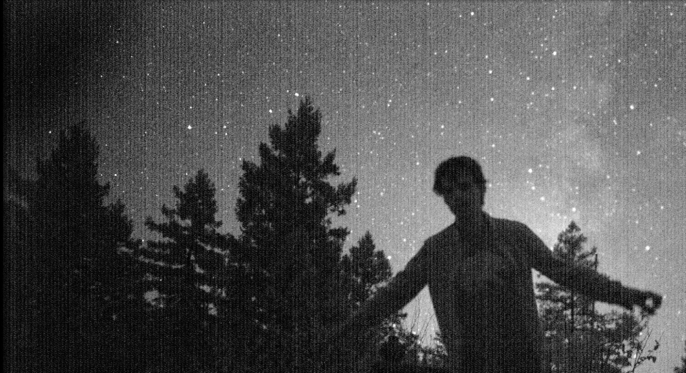
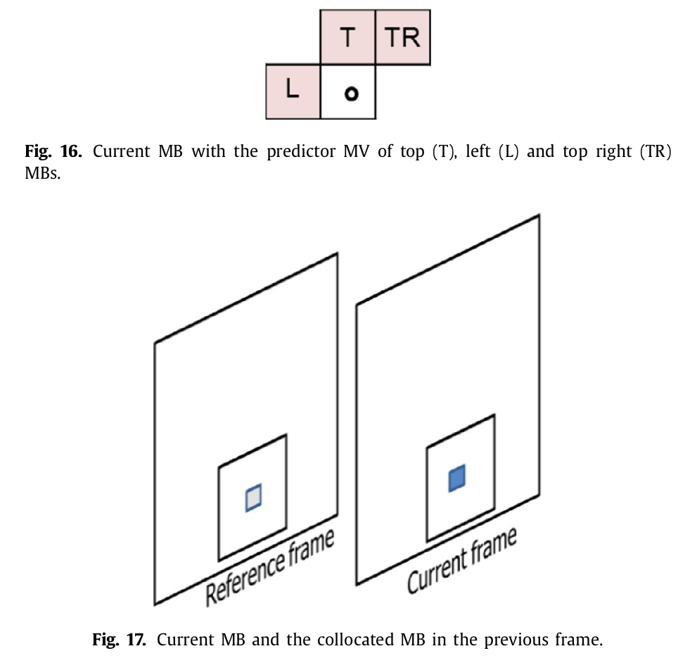

# Gravitychen's notebook
[Great!]

- Ultimate Goal
  - Maintain source signal while eliminating noise under low light environment
  - Unlike the approach of night sight (synthesizing the sharpest image from burst), our mission is to find the image most similar to the last frame from the burst
  - Real-time

- Daily Mantra
  - Do what's needed
  - Less judgment and thinking systematically
  - Stay happy!

 - Questions：
   - how to revover the color information?
     - deep auto white balance or color consistancy
   - Cuda accelaration

 - IDEA: 三部曲(检测到改变，融合起来，美化)
   - 检测到改变
     - notice the FPS for searching
     - HE 增强edge信息
     - (Qilin)巧用金字塔结构，参见HDR fusion的经典问题，特征在不同分辨率下的玩法。 OK!
     - **只用 NIR or NIR+R 来搜索Mition Vector**
     - **要用相对的阈值，如果用绝对阈值，只能搜索到亮度本身就强的地方**
     - **然后 用MV去找 RGB**
   - 融合起来
     - distance statistics (选多少frame的时候做)
     - increase bucket size and sort the distance and do merging
     - DCT 去smooth一下 看效果会不会好 
        - A(qilin) 可以先estimate一下blur核，然后搞个简单的维纳滤波试试。 OK!
   - 美化
     - tone mapping完做spatial denoise
     - 人眼 高SNR pleasing 系统
     - (Qilin) Whitebalnace 问题可以试一下19年aisa的auto whitebalance。 OK!
   - DRV raw的pixel强度居然低于黑电瓶, 
     - A(qilin) 对，所以这也是这个工作对super low light video work的原因，其他方法都忽略了这个问题。OK！
     - Starlight 的数据倒是很多0，不知道他们事先做了哪些操作，
 
 - Solved:
   - 低频有noise是个大问题吗？
     - A(qilin) 看图大概率像是fix pattern noise, 可参考 [offline-vpp](https://github.com/centreborelli/off-line-vpp/tree/master/src), [depattern maps](https://github.com/will-henney/depattern-maps)
   - diff 就是 mismatch了。拿来要怎么用, object 移动的话不merge，dist大的话不merge，dist大的话weight小
   - 更多张的raw解决noise过多，（相机noise参数）
   - 考虑 burst里 sharpness的 强度 和 傅里叶距离类似 (注意night sight是要从burst输出最尖锐图，我们是要输出 最尖锐当前帧)
   - 手抖都能建模，还有什么不能建模 （手抖PSF ill posed，去弄计算量会太大），我们没有手抖吧？我们的是 motion blur
   - merge 的时候不应该依照 之前块的 相对大小 给权重，而是要从绝对大小给权重 (a e^-c*x, pre-weight setup)
   - downsample再去search vs 直接search 哪个好
     - 拜耳数组的自然结构会不会影响alignment和merging时的计算
     - A(Qilin): 为了减少计算量是可以先搞个mipmap结构，downsample的search完能匹配上再去一层层往上走，匹配不是就说明肯定不行。注意downsample方式. OK!

### Todo
 - DeepAWB or FFCC python
 - Accelerating block distance 

### July
 - motion filtering
  
    |without filtering | | | | 
    |-|-|-|-| 
    |with filtering | | | | 

### July 9th
 - Clean code and write LTM videos

### July 8th
   - Implement "+" FFT
     - try different Fourier masks but the result shows that inversed image tends to have a white wave in front of the original image, while the strong column noise still **cannot** be moved.
       |gamma (no fft) |gamma (no fft) | FFT (gamma2.2)| FFT (gamma2.2)| FFT(gamma2.2) |
       |-|-|-|-|-|
       | 1/1.2 | 1/2.2 | | | |
       | | | | | |
     - so we cancel the fourier filter

### July 4-5th
   - HSV conversion
   - Local tone mapping
     
   - Accelerating block distance 

### July 3rd
   - Running ISP and several experiments (after gamma correction) show that the wrong color appears very frequently and is sensitive to parameters.
    
      |demosaicking result (no FFT after merge)|demosaicking result (FFT after merge) | wrong color |
      |-|-|-| 
      | | | |
   - [Gamma result](https://ecsosaka-my.sharepoint.com/:v:/g/personal/u091045f_ecs_osaka-u_ac_jp/ERraiMuVxmJEq4pjzA7vrG4B1VcdIItgzc5E3Orv3Knujg?e=fYvwxi) (crazy bad white balance)

### July 2nd
   - bandpass filter on Fourier domain
     - rectangle size and horizontal experiments
        
        | rectangle size | 20 | 40 | 100 |
        |----------------|----|----|-----|
        | FFT            |    |    |     |
        | details        |    |    |     |
     
### July 1st
 - Continue Optimizing HDR+ process
   -  default setting produces too much noise (gray images)
     - method keepAlternate bad
     - method pairedAverage bad
     - method DFTWiener
        | temporal factor | spatial factor | comments  |
        |-----------------|----------------|-----------|
        | 75              | 0.1            | noisy     |
        | 750             | 0.1            | noisy     |
        | 7500            | 0.1            | best      |
        | 75000           | 0.1            | arm ghost |
        | 7500            | 0.1            | OK        |
        | 7500            | 1.0            | **OK**      |
        | 7500            | 10.0           | OK        |
        | 7500            | 100.0          | little blury |
        | 7500            | 1000.0         | blury  |
    | default factor |better factor |
    |-|-|
    | | |

### June 29 - 30th 
 - Finish ISP process
    
 - So hdr+ process still not works so well, noise can be further reduced by averaging or finetuning the parameter
  - Optimize HDR+ process
     - motion vector visualization.
     - three experiments are conducted which includes *FPN_removal_with_clip*, *FPN_removal_without_clip*, *without_FPN_removal*. 
     - These experiments all perform well but *without_FPN_removal* is slightly better than others. However, the visualization result show that noisy signal misguides the alignment process)
    
        | | | |
        |-|-|-| 
        |index = 1 | index = 3| index = 5|

### June 28th 
 - **fast** open ISP study
   - dead pixel + black level + anti aliasing + manual white balance + chroma noise filter + demosaicking + color correction + gamma correction 
    
    | white balance | demosaicking|color correction |gamma correction |
    |-|-|-|-|
    | | | | |
   - Both aligning and merging takes 4 seconds per burst(8 images)
   - above ISP process takes 0.5s 

### June 27th 
 - mipmap align + spatial temporal merge + rawpy ISP 
 - aligh + merge [result](https://ecsosaka-my.sharepoint.com/:v:/g/personal/u091045f_ecs_osaka-u_ac_jp/EYmREi-B8d9Gh0pUhq4oz58BW8n0fCNJQfYSyYeoIL3YPQ?e=mypw2c)
 - rawpy ISP [result](https://ecsosaka-my.sharepoint.com/:v:/g/personal/u091045f_ecs_osaka-u_ac_jp/EW8N_6s-T6dAufdRnaxJOtoBlGgcDC4caB_uDnHrjr_72g?e=TZfaq7) with finetune parameter

### June 24-26th 
 - Make sure the alignment algorithm didn't go wrong since there may have some object-scene blur
   - detail changes:(increase the macroblock size, normalize SAD, find the parameter of aligning and merge coefficiency)
 - Visualize Motion vector map
 - Green interpolation from NIR ([green pixel replacement](https://ieeexplore.ieee.org/stamp/stamp.jsp?tp=&arnumber=7168366))
    | process |RGB_NIR |RGB_G-NIR+NIR |
    |-|-|-|
    | | | |
 - Do ISP after green pixel replacement using fastOpenISP (0.161s)
   |their raw ISP (RGB stack 640*1080)  | our raw ISP (1280*2160) |
   |-|-|
   | gray world +bilinear + gamma    | manual + malvar + gamma   | 
 - Yoga class
   

### June 23th 
 - Smooth using windows function
   - cosine
    
    |before overlap |after overlap |
    |-|-|
    | | |
     
 - 整理 RGB-NIR ISP 问题
   - https://sci-hub.st/10.1109/IPTA.2017.8310105
   - modality fusion 又是另一个大问题
   
### June 22th
 - Use overlap tiles

    concatenation of overlapped merge result
    
  
### June 21th
 - Debug merge process
   - Average mean for spatial distance: make and visualize patch-wise mismatch map and adjust the searching threshold for eliminating the ghost effect 
     | | | |
      |-|-|-| 
   - debug [result](https://ecsosaka-my.sharepoint.com/:f:/g/personal/u091045f_ecs_osaka-u_ac_jp/EsF4_Dd3mXdOsyg7knBzYKMBfLsyYpsU0GhSoPXkJ40c5Q?e=41qzvj) (bucket size = 8)

### June 20th
 - Debug merge process
 - About RGB-NIR papers
   - https://ieeexplore.ieee.org/stamp/stamp.jsp?arnumber=7953319&casa_token=FsswKCwozrQAAAAA:VoiWheiEYsLtCuVH2Mm-_7sad-VKB0Q-fR6cFfO7yRM7VFYP38WaH7Qu6NMoF2fB37DjtVFf07o
   - https://sci-hub.st/https://doi.org/10.1117/1.JEI.26.4.043017.short
   - https://ieeexplore.ieee.org/stamp/stamp.jsp?tp=&arnumber=8451413
   - https://link.springer.com/content/pdf/10.1007/s11042-016-4141-4.pdf
   - 

### June 20th
 - Check FPN bug
  - Done! check the [result](https://ecsosaka-my.sharepoint.com/:f:/g/personal/u091045f_ecs_osaka-u_ac_jp/ElJXfXWAegVMtpJx9O_dpkkB5fNRuHM9WrT0gzQQ83mfyQ?e=WNfoJA) 
   
### June 19th
 - torch.jit.script learning
 - FPN removal (vmin=30,vmax=2000) 
   | | | | |
   |- |- |- |- |

### June 18th
 - alignment code
 - merging code
 - write video (weighted mean, coef = 0.01, align threshold = )
   - FIFO size = 2 (0.44s per bucket (aligned + merged) in CPU)
   - FIFO size = 4 (3.17s per bucket (aligned + merged) in CPU)
   - FIFO size = 8 (7.30s per bucket (aligned + merged) in CPU)
   - concat [video result](https://ecsosaka-my.sharepoint.com/:f:/g/personal/u091045f_ecs_osaka-u_ac_jp/EuB-YfrR2U9CoSxiW0ym3rEBEYUOtv3kWOQcxslPoqaUTQ?e=61Kurl)

### June 17th
 - Preprocess
   - Downsampling is preferred because the NIR component can contribute to the pixel intersity.
   - Gamma mapping  $x^\frac{1}{2.2}$ 
      
 
 - Visualize mismatch map
   - Choose "turbo" color map for good-looking (0,4,5,6)
   - Max value = 0.856, visualization max value = 0.756
      
      
     

### June 16th
  - Running starlight experiemnt
    - They stack RGB pattern to a RGB pixel and only use NIR pattern when model training.
    - Bad ISP (bilinear demosaick + fixed white balance + gamma)
    - their model inference costs 1.26s per frame with GPU
      |naive| their model|
      |-|-|
      | | |
      | | |
    - their [video](https://ecsosaka-my.sharepoint.com/:i:/g/personal/u091045f_ecs_osaka-u_ac_jp/EcyRBnp8oBRBvW990UpqF68B_T01rhMAMlk7w_Z6RKY-zQ?e=pTOuUo)
  - our naive average [result](https://ecsosaka-my.sharepoint.com/:v:/g/personal/u091045f_ecs_osaka-u_ac_jp/ETTfbvnWUGhGoXvNXfY4basB82EY3ZYjlaj7xnnoecivng?e=A7ascm) (downsampled)
  - our naive average [result](https://ecsosaka-my.sharepoint.com/:v:/g/personal/u091045f_ecs_osaka-u_ac_jp/ESMQb2KE9LBKu4EuEo7M81UB5yOWw12XMr2pt099Bi-AgQ?e=vCU3Pg) (downsampled) with gamma(**1/2.2)

### June 14-15th
  - Study AWB methods
  - Study comparison methods
  - Collect data
  - Complete table below

### June 12-13th
 - Choose other SOTA methods
    |     | low light video denoise | normal light video denoise | low light image |
    |-----|-------------------------|----------------------------|-----------------|
    | RAW |  [starlight_denoising](https://kristinamonakhova.com/starlight_denoising/)  [seeing motion in the dark](https://github.com/cchen156/Seeing-Motion-in-the-Dark)   |                            | [CVPR22 night imaging workshop](https://nightimaging.org/final-leaderboard.html)([rank 1](https://openaccess.thecvf.com/content/CVPR2022W/NTIRE/papers/Liu_Deep-FlexISP_A_Three-Stage_Framework_for_Night_Photography_Rendering_CVPRW_2022_paper.pdf),[rank 2](https://njuvision.github.io/CBUnet/))    learning to see in the dark    [unprocessing](https://www.timothybrooks.com/tech/unprocessing/)     |
    | RGB |                         |  [Fastdvdnet](https://github.com/m-tassano/fastdvdnet?utm_source=catalyzex.com)   [Video Restoration Transformer](https://github.com/jingyunliang/vrt)   [PaCNet](https://github.com/grishavak/PaCNet-denoiser)   |                 |
 - Compare some hdr+ repositories to determine acceleration tool
    |                    | C halide HDR+                                  | pytorch  HDR+                                         | numba HDR+                                    | pyHalide HDR+                                                | Ours   |
    |--------------------|------------------------------------------------|-------------------------------------------------------|-----------------------------------------------|--------------------------------------------------------------|--------|
    | code               | code https://github.com/timothybrooks/hdr-plus | code https://github.com/martin-marek/hdr-plus-pytorch | code https://github.com/amonod/hdrplus-python | code https://github.com/792x/HDR-Plus-Python                 | -      |
    | language           | C                                              | python                                                | python                                        | python (hard to debug)                                       | python |
    | burst resolution   |                                                | [8,3672,5504]                                         | [8,3672,5504]                                 | [8,3672,5504]                                                |        |
    | preprocess latency |                                                | 4.51s                                                 | 1.04s                                         | halide hard to count seperately                              |        |
    | alignment latency  |                                                | shows below(without subpixel alignment)               | 7.7s                                          | halide hard to count seperately (without subpixel alignment) |        |
    | merging latency    |                                                | 3.504s (average merging + align)                      | 11.6s  (robust merge)                         | halide hard to count seperately (robust merge)               |        |
    | ISP tool           |                                                | rawpy                                                 | rawpy + additional python code                | self-write pyHalide                                          | rawpy  |
    | ISP latency        |                                                | 0.48s                                                 | 5.4s                                          | halide hard to count seperately                              |        |
    | accelaration type  |                                                | GPU                                                   | CPU numba                                     | CPU                                                          |        |
    | Total latency      |                                                | 9.13s                                                 | 25.5s                                         | 9.16s                                                        |        |
    | result             |                                                |  Normal light       Default parameters for dark image   |  Normal light       Default parameters for dark image    |      Normal light        Optimized paramter for dark                                             |        |
 - Interesting AWB project
   - https://github.com/google/ffcc?utm_source=catalyzex.com
   - https://github.com/mahmoudnafifi/WB_color_augmenter
   - https://github.com/mahmoudnafifi/WB_sRGB
   - https://github.com/mahmoudnafifi/mixedillWB
   - https://github.com/QiuJueqin/Reweight-CC

### June 10-11th
 - Transfer code to Pytorch for GPU acceleration
   - dataloader spends lots of time 
   - loading latency table (around 0.1s per burst when bucket size equals to 10)
      | num_workers=0  | batch_size=2  | batch_size=4 |
      |---|---|--|
      | BUCKET_SIZE=4   | 5.3  | -- |
      | BUCKET_SIZE=8   | 10.2 | -- |
      | BUCKET_SIZE=10  | 9.1  | 8.8 |
      | BUCKET_SIZE=12  | 10.2 | -- |

   - A batch (shape : [8,10,3672,5504]) can load 20G GPU memory
   - Rawpy ISP takes around 0.05s per image (much faster than hdr+ ISP)
   - Simple average merging takes around 0.05ms per burst 
   - If the target scene has at least an amount of light (e.g. "DRV/0004"),  then (average merging + Rawpy-ISP) is Good. (FPS = 109/9 = 12.1)
     - [screen record](https://ecsosaka-my.sharepoint.com/:v:/g/personal/u091045f_ecs_osaka-u_ac_jp/EQjbpRFZu7tBmzeRi2gXa6sB2cnhK4r2LlygNZNhJLXDsw?e=QMkg7Y) 
   - If the target scene is too dark, the (average merging + Rawpy-ISP) is still noisy
     - [screen record](https://ecsosaka-my.sharepoint.com/:v:/g/personal/u091045f_ecs_osaka-u_ac_jp/ERXJZRtje81KmdfICJD900ABn43vIV_klC6CFNTPMKOySQ?e=aa44fF) 
 

### June 8-9th
 - merge demo complete! **Check** [**this**](https://ecsosaka-my.sharepoint.com/:v:/g/personal/u091045f_ecs_osaka-u_ac_jp/EbSBz7inYqtLobQuoadhYe4BsN0iKlblEY0MP03DyTikjw?e=IfevaK).
   - Problem: White balance shift
 - Run [numba-hdr+](https://github.com/amonod/hdrplus-python) and record speed for each step (10 images **using numba**, resolution = [3672,5504]). 
   - *So this repo is bad and slow for low light image enhancement*
   - | log (milliseconds) |  hdr output with auto_exposure | alignment (motion accuracy need to be improved) |
     |---|---|---|
     |  Read raw files:  897.16  Aligned burst :  10246.16  Merged burst  :  12612.64  Post-processed ref. image w. gamma :  1261.35  Post-processed merged image w. gamma :  408.88  Apply LTM     :  1664.75  Apply GTM :  149.15  Apply Gamma   :  106.75  Apply sharpen :  1579.51  Applied finishing to ref. image :  4911.25   **Finished** + wrote output files :  **10495.32**  **Total Burst processed** :  **34255.19**   |   |  |

 - Study paramid fusion

### June 6-7th
 - merge DRV data
   - Merged result check [here](DRV_merge.md)
     
 - write video using videogear. 
   - click [here](https://ecsosaka-my.sharepoint.com/:f:/g/personal/u091045f_ecs_osaka-u_ac_jp/Ek208JfIScdFuhAMjh6rLWUBRq5fkQtbXYqMHcEp5gR_TQ?e=9RhsQs) to see video (They are to large)  

### June 5th
 - Select an extremely low light dataset! - DRV OK!
 - Read DRV and make the video - OK (NOTICE the FPS!!) 
 - Functionize ISP in my project(fast open ISP + rawpy + numba-hdr+ )
   - Speed test. 
     - 3672, 5496
     - fast open ISP  9.538s
     - Rawpy ISP  0.312s

### June 4th
 - Visualize merge result (BUCKET_SIZE = 4, MATCH_THRESH = BLOCK_SIZE * BLOCK_SIZE * WHITE_LEVEL * 0.005 )
    |        | blk size=20 | blk size=40 | blk size=60 | blk size=120 |
    |--------|-------------|-------------|-------------|--------------|
    | c=3e-2 (blur) |              |             |             |              |
    | c=1e-2 |              |             |             |              |
    | c=3e-3 |              |             |             |              |
  

### June 3rd
 - Check HDR+ code to see if they deal with the natural raw structure.(Yes, It's OK to process natural raw structure).
 - ISP
   - compare ISP
       | FastOpenISP | rawpy([pytorch accelarate HDR+ rawpy](https://github.com/martin-marek/hdr-plus-pytorch)  )  | [HDR+ halide ISP](https://github.com/792x/HDR-Plus-Python)   |
       | --- | --- | --- |
       | [1080, 1920] 0.6s  | [3672, 5504] 0.46s | [3036, 4048] 5s  |

 - Formulate weighted sum
     $$ c = white level * coef , e.g. 328 = 4095 * 0.08$$
     $$ w_i = \frac{c}{x_i + c} , e.g.  \frac{328}{x + 328}$$

 - Visualize curve  
     
   
### June 2nd
 - Directly searching without downsampling
 - Directly searching with downsampling
   - Visualize Spatial and DCT distances from similar images
   - 
      | downsample patch120_h7_w13 | w/o downsample patch120_h7_w13|
      |---|---|
      |   |   |
      | |  |
      | |  |
      | |  |
      | |  |

   - 对一下内容保留疑问,还是要看最后merge的结果说话，看看 HDR+ 有没有分bayer处理
   - the experiment above shows accurate distance calculation (both spatial distance and DCT distance) benefits from downsampling. It can be seen from the table that if the Bayer array is not averaged, there is a sudden change in the distance calculation results between similar patches with similar appearances. This problem comes from the Bayer pattern since different CFAs have different quantum efficiencies. If one pixel appears on other types of CFA after displacement, the different properties of CFA itself will affect the calculation results of both spatial distance and DCT distance. Therefore, a problem we encountered is that the natural structure of the Bayer array will affect the calculation during alignment and merging, but the input of the finishing needs to be in the format of the Bayer array.
   - (上面的实验显示了精确的距离计算（空间距离和 DCT 距离）受益于下采样。 从表中可以看出，如果没有对拜耳阵列进行平均，具有相似外观的相似块之间的距离计算结果会发生突变。 这个问题来自拜耳模式，因为不同的 CFA 具有不同的量子效率。 如果一个像素点在位移后出现在其他类型的 CFA 上，CFA 本身的不同属性会影响空间距离和 DCT 距离的计算结果。)

### June 1st
 - Construct merging pipeline 
   - Write merging pseudo code
   - Formulate DCT weights (Similarly for spatial)  
     
   $$ \delta_{dct}^i= \frac{|| DCT_{i} - DCT_{ref} ||_{2}^{2}}{\sum^{x}_{i=1} || DCT_{i} - DCT_{ref} ||_{2}^{2}} , \ \ \sum^{x}_{i=1} \delta_{dct}^i=1$$ 
   $$ \omega_{Di} = \frac{\alpha^i}{\sum^{x}_{i=1} \alpha^i} , \alpha^i = \frac{1}{\delta_{dct}^i}$$ 
   $$NoNoNoNoNoNo!!!! 这么做是相对权重，不好$$

### May 31th
 - Meeting
 - Download [HDR+ dataset](https://hdrplusdata.org/dataset.html)

### May 30th
 - DCT FFT speed test for burst (shape:[8,3,1661,2261])
   - FFT 5.2s
   - DCT 2.7s 
 - Study [code](https://github.com/cwhuang1937/Fourier-Burst-Accumulation-Python) of [Removing Camera Shake via Weighted Fourier Burst Accumulation](https://arxiv.org/pdf/1505.02731.pdf)

### May 27-29th
 - revisit night sight paper

Suppose we have a noisy image
 - Adaptive weighted sum results in a tradeoff between denoise and deblur
 - Think about how to construct our "shrinkage" operation 

Suppose we have a denoised or high SNR image
 - Once we have a denoise burst, then the next goal is to **preserve details from low light burst**. (to enhance contrast and solve color degradation)

### May 26th
 - ARPS latency (single image, single CPU); 
    | latency (s)                                                                                      | block size = 4 | block size = 8  | block size = 20  | block size = 40  | block size = 60       | block size = 120 |
    |--------------------------------------------------------------------------------------------------|----------------|-----------------|------------------|------------------|-----------------------|------------------|
    | resolution[1080,1920]                                                                            | 3.53           | 0.95            | 0.162            | 0.054            | -                     | 0.024            |
    | resolution[16-1,1080,1920]  (similar image can be faster, maybe set match thresh can accelerate, thresh in exp = 100) | -              | 26.1 avg = 1.74 | 4.28 avg = 0.286 | 1.33 avg = 0.088 | 0.717 average = 0.048 | 0.34 avg = 0.023 |
 - Average block-matched stacks
    
    

### May 25th
  - Problem statement
    - Both noise and source signal dominate the high-frequency component in image space.
    
    - **Shortcoming** of self-similarity based denoising algorithm **under extremely low light condition**
      - The self-similarity denoising algorithm, such as non-local mean, assumes that the overall image has a certain magnitude of SNR and the noise distribution has zero-mean property, but in fact the SNR of the image captured under dark light is very low and the cmos sensor has a non-zero-mean noise distribution, such as [thermal noise](https://zhuanlan.zhihu.com/p/397873289#:~:text=%E5%AE%83%E4%B8%8E%E6%B8%A9%E5%BA%A6%E6%88%90%E6%8C%87%E6%95%B0%E5%85%B3%E7%B3%BB%EF%BC%8C%E6%B8%A9%E5%BA%A6%E6%AF%8F%E5%8D%87%E9%AB%986%E6%91%84%E6%B0%8F%E5%BA%A6%EF%BC%8C%E6%9A%97%E5%99%AA%E5%A3%B0%E7%9A%84%E5%9D%87%E5%80%BC%E6%89%A9%E5%A4%A7%E4%B8%80%E5%80%8D), so using the **averaging strategy tends to destroy the information of an original image**. 

      - The sensor noise contains both spatially independent noise and spatially dependent noise, such as read noise and fix pattern noise. Due to the SNR of captured image is small, **spatially dependent noise will cause the alignment algorithm to fail in very dark images**.
        - For example, fix pattern noise will affect the distance calculation between blocks, resulting in incorrect matching results
          
          

   - Ideas:
     - Separate the two problems with the idea of divide and conquer
       - First remove sensor noise by using the physical characteristics of sensor ([matlab code for noise generation](https://code.google.com/p/highlevelsensorsim/)) 
       - Then use merging or super resolution technique to improve the high-frequency information of source signal
       - Always pay attention to the computational complexity of the above two steps

### May 24th
 - Code merging pipeline with simply averaging
 - Read papers
   - Advantage of fourier accumulation? [Burst Deblurring: Removing Camera Shake Through Fourier Burst Accumulation](https://sci-hub.st/10.1109/CVPR.2015.7298852)
   - How to handle Dynamic? [Robust Patch-Based HDR Reconstruction of Dynamic Scenes](https://web.ece.ucsb.edu/~psen/hdrvideo)
   - How to handle Dynamic? Why fast? [Fast Burst Images Denoising](https://dl.acm.org/doi/pdf/10.1145/2661229.2661277?casa_token=RPPx5PUh4aAAAAAA:8EpS2WwjgUpVso9ipiKBsPblzD47mPSrBL4v42Rox7zTOvfS_-LqzceOL6lpFBgNZJ4-8_ner5Ibcw)
   - [Handheld Multi-Frame Super-Resolution](https://blog.csdn.net/kate_LLLiu/article/details/113784280) [code](https://github.com/ricsonc/more-pixels-less-noise/blob/master/merge.py)

### May 23th
 - Update pipeline
     

### May 21th
 - Functionize alignment
 - study merging methods
   - [the state of the art in hdr deghosting a survey and evaluation](https://web.cs.hacettepe.edu.tr/~erkut/publications/HDR-deghosting-star.pdf) 
   - [handheld mobile photography in very low light](http://graphics.stanford.edu/papers/night-sight-sigasia19/night-sight-sigasia19.pdf) 

### May 20th
 - Checking ARPS robustness
   - large steps movement, OK
   - top-left or bottom-left movement, OK
   - real images, OK
    
    | random downward 2 rows | random downward 3 rows | random downward 4 rows | real  image |
    |---|---|---|---|
    |   |   |  |  |

    | reference | previous            | searched previous (blk_size = 20)   |
    |-----------|---------------------|---------------------|
    |           |                     |                     |
    |           | diff with reference | diff with reference |
    |           |                     |                     |

### May 19th
 - C++ to python conversion
   - ARPS step 1 + 2 + 3 , OK
 - experiment: 
   - Generating random mask and down-rolling current image for 2 rows and obtain reference image
   - Implementing ARPS and get motion vector **(h = 2,w = 0)**. Note that green box is the ground truth.
     
     

### May 18th
 - C++ environment setup
 - ARPS code study

### May 17th
 - ARPS method study
 - ARPS code study
 - Constructing matching steps
   - We will use the pixel subsampling technique to downsample the raw image for avoiding considering the color structure of bayer pattern and also reducing the computational cost. 
   - Current mainstream CMOS sensors are made of silicon-based materials, which have a low photoconversion efficiency in the blue wavelength band, images taken under low illumination conditions often have the [most significant noise](https://zhuanlan.zhihu.com/p/102423615#:~:text=%E7%9B%AE%E5%89%8D%E4%B8%BB%E6%B5%81%E7%9A%84-,CMOS%20sensor,-%E9%83%BD%E6%98%AF%E4%BD%BF%E7%94%A8%E7%A1%85) in the blue channel. Therefore, the blue channel as well as red channel will be ignored since it ignores the effect of chromatic noise under low light and increases the calculation speed by 50%. 
   - We average the green component of the bayer pattern and use Sum of Absolute Differences (SAD) as the matching metrics instead of Mean Absolute Difference (MAD) or Mean Square Error (MSE) to avoid additional computation.

### May 16th  
 - Reviewing and comparing several block matching algorithm
   - Motion estimation is the main challenge for implementing real-time video encoding because of its huge complexity. (accounts for 50%-80% of the whole video encoder complexity)
   - Full search (FS) or Exhaustive search (ES) is definitely not suitable for real-time video encoding.
   - Motion estimation is used in [x264](https://github.com/corecodec/x264). **Click**  [here](https://img-blog.csdn.net/20150523184102882?watermark/2/text/aHR0cDovL2Jsb2cuY3Nkbi5uZXQvbGVpeGlhb2h1YTEwMjA=/font/5a6L5L2T/fontsize/400/fill/I0JBQkFCMA==/dissolve/70/gravity/SouthEast) to check **comparison**.
      | Diamond search                                                                                                                                                                                                                                                                                  | Hexagon search                                                                                                                                                                                                                            | Multi-Hexagon-grid search                                                                                                                                                                                                                                                                   | Exhastive search | Transformed exhausive search                                                                                                                                                                                                                                                      |
      | ----------------------------------------------------------------------------------------------------------------------------------------------------------------------------------------------------------------------------------------------------------------------------------------------- | ----------------------------------------------------------------------------------------------------------------------------------------------------------------------------------------------------------------------------------------- | ------------------------------------------------------------------------------------------------------------------------------------------------------------------------------------------------------------------------------------------------------------------------------------------- | ---------------- | --------------------------------------------------------------------------------------------------------------------------------------------------------------------------------------------------------------------------------------------------------------------------------- |
      | [code](https://github.com/corecodec/x264/blob/5493be84cdccecee613236c31b1e3227681ce428/encoder/me.c#L322)                                                                                                                                                                                       | [code](https://github.com/corecodec/x264/blob/5493be84cdccecee613236c31b1e3227681ce428/encoder/me.c#L344)                                                                                                                                 | [code](https://github.com/corecodec/x264/blob/5493be84cdccecee613236c31b1e3227681ce428/encoder/me.c#L422)                                                                                                                                                                                   | deprecated       | [code](https://github.com/corecodec/x264/blob/5493be84cdccecee613236c31b1e3227681ce428/encoder/me.c#L619)                                                                                                                                                                         |
      | [example](https://blog.csdn.net/leixiaohua1020/article/details/45936267#:~:text=%E8%BF%90%E5%8A%A8%E6%90%9C%E7%B4%A2%E6%96%B9%E6%B3%95%EF%BC%9A-,%EF%BC%881%EF%BC%89%E8%8F%B1%E5%BD%A2%E6%90%9C%E7%B4%A2%E7%AE%97%E6%B3%95%EF%BC%88DIA%EF%BC%89,-%E4%BB%A5%E6%90%9C%E7%B4%A2%E8%B5%B7%E7%82%B9) | [example](https://blog.csdn.net/leixiaohua1020/article/details/45936267#:~:text=%EF%BC%882%EF%BC%89-,%E5%85%AD%E8%BE%B9%E5%BD%A2%E6%90%9C%E7%B4%A2%E7%AE%97%E6%B3%95%EF%BC%88HEX%EF%BC%89,-%E8%AF%A5%E6%96%B9%E6%B3%95%E9%87%87%E7%94%A8) | [example](https://blog.csdn.net/leixiaohua1020/article/details/45936267#:~:text=%EF%BC%883%EF%BC%89%E9%9D%9E%E5%AF%B9%E7%A7%B0%E5%8D%81%E5%AD%97%E5%9E%8B%E5%A4%9A%E5%B1%82%E6%AC%A1%E5%85%AD%E8%BE%B9%E5%BD%A2%E6%A0%BC%E7%82%B9%E6%90%9C%E7%B4%A2%E7%AE%97%E6%B3%95%EF%BC%88UMH%EF%BC%89) | -                | [example](https://blog.csdn.net/leixiaohua1020/article/details/45936267#:~:text=%E6%9C%80%E4%BC%98%E5%8C%B9%E9%85%8D%E7%82%B9%E3%80%82-,%EF%BC%884%EF%BC%89%E8%BF%9E%E7%BB%AD%E6%B6%88%E9%99%A4%E6%B3%95%EF%BC%88ESA%E3%80%81TESA%EF%BC%89,-%E8%AF%A5%E6%96%B9%E6%B3%95%E6%98%AF) |

   - Other popular block matching algorithms are also mentioned in [A survey on video compression fast block matching algorithms](https://www.sciencedirect.com/science/article/abs/pii/S092523121831261X?casa_token=am8pxTFfMJoAAAAA:S4zTh7LhxcHUjVY-eNr5edJktXP3fKkcTnAxWOgwNBcGprB7zRFrBusUbARKRRn4XuWoLCw) 
  
      | Three Step Search (TSS) | New Three Step Search (NTSS) | Simple and Efficient Search (SESTSS) | Diamond Search (DS)  | Predictive Search  | Adaptive Rood Pattern Search (ARPS) | Hierarchical or multiresolution search |
      | --- | ---- | ------ | --- | ---- | -------------------------------------- |  -- |
      |  |   |    |   |   |   |   |

   - The table 5 and table 6 of above suyvey paper shows the average number of search points for a Microblock of size 16×16 and the performance of fast black matching algorithms respectively. For more intuitive observation, The scatter chart was made for visualization. The x-axis shows the average number of search points in logarithmic scale (Lower is better).  The y-axis shows PSNR performance in linear scale (Higher is better). 
    

   - Although DA is the fastest matching algorithm in the open-source x264 library, after the above survey, we will use ARPS as our core matching algorithm because ARPS is **2 to 3 times** faster than DA and it also outperforms DA with a higher PSNR. [C code of ARPS](https://github.com/thomas-pegot/esp32-motion/blob/33e853a2c4f5de80f4ada9d715574d659b20fb41/block_matching.c#L120)

 - RawTherapee

### May 15th  
 - H265 vs H264 speed && complexity comparison
   - Kvazaar and x265, suffer from inflated average BD-BR(Bjøntegaard Delta Bit Rate) of +2.4% and +14.6% over HM (the HEVC reference software). However, HM lags far behind in coding speed.
   - ***Kvazaar*** is **125 times** faster than ***HM*** and  **3 times** as fast as the practical ***x265*** HEVC encoder on a 22-core processor with vectorization enabled. See [Table 5](https://trepo.tuni.fi//bitstream/handle/10024/129907/ACMMMSys20_camera_ready_submission1.pdf?sequence=1).
   - However, x264 is still  faster than above frameworks with a lower yet acceptable visual quality ([statistics](https://youtu.be/_Q6J2_nvLSI?t=300)). The reason behind this is that h.265 come up with a new concept, called [coding tree unit](https://en.wikipedia.org/wiki/Coding_tree_unit), which increases the computational cost.
   - In order to reduce the encoding bit rate, we usually use predictive coding to get the correlation between video frames, which is typically done by subtracting the encoded neighboring block from the block of the current frame to get the residual values. It is worth mentioning that motion estimation is the **core technique** in predictive coding due to it has the highest computational complexity among other processes in video compression (accounts for 50%-80% of the whole video encoder complexity). Therefore, the next step will be to investigate the motion estimation technique within h.264 and its variants since h.264 performs faster than other video compression standard.
      - [A survey on video compression fast block matching algorithms](https://www.sciencedirect.com/science/article/abs/pii/S092523121831261X?casa_token=am8pxTFfMJoAAAAA:S4zTh7LhxcHUjVY-eNr5edJktXP3fKkcTnAxWOgwNBcGprB7zRFrBusUbARKRRn4XuWoLCw) 
 
 - RawTherapee

### May 14th 
 - ISP speed test 
   - Fast-openISP pipeline takes around 3.3 seconds with 2.2 seconds on non-local mean without numba accelaration
   - After canceling NLM, it takes around 0.6 seconds on the 1080p resolution without numba accelaration
 - H265 code study

### May 13th 
Packet TIFF iamges into FIFO Queue 
 - numba
 - build filmulator (for RAW visualization on ubuntu)
 - ISP

### May 12th
 - FIFO Queue
 - Download [CRVD dataset](https://github.com/cao-cong/RViDeNet#dataset)
 - [Paper](https://trepo.tuni.fi//bitstream/handle/10024/129907/ACMMMSys20_camera_ready_submission1.pdf?sequence=1) and [code](https://github.com/ultravideo/kvazaar) of **fast and effcient H265 encoder**
 - ICASSP presenting 

### May 11th
 - pybind11 demo
 - [python implementation of HDR+](https://github.com/amonod/hdrplus-python)

### May 10th
Set up enviroment for [HDR+](https://github.com/timothybrooks/hdr-plus)
 - Libraw LLVM Halide 

