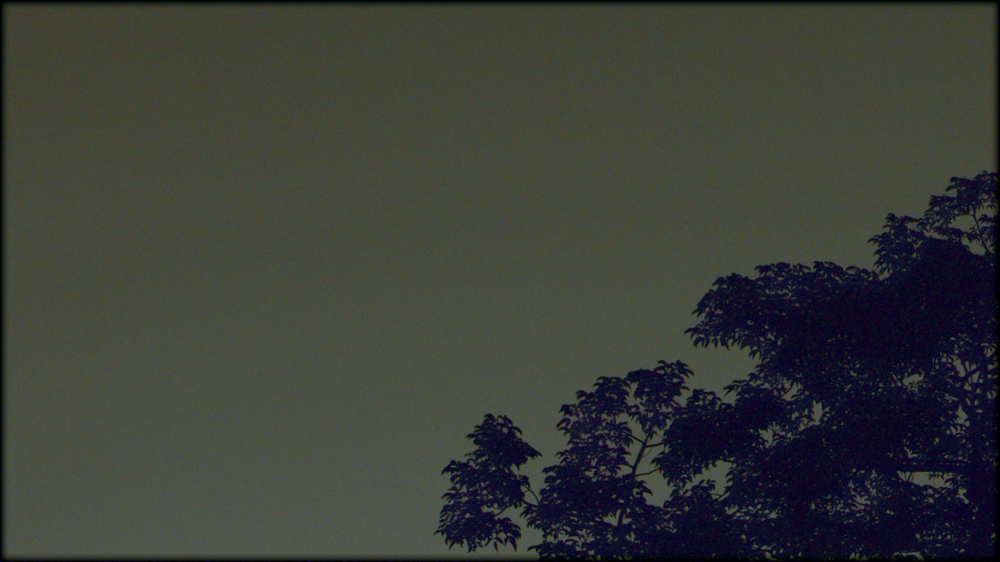

## 工作进程：

### 2023.4.17-4.22

+ patch match方法是基于相邻随机采样和传播来快速找到原图所有patch与目标图patch间的对应关系，从而基于此对图像进行重构。在高噪声情况下不是很适用，很难重构出。

+ 文献阅读

    + [Needle match](https://openaccess.thecvf.com/content_cvpr_2016/papers/Lotan_Needle-Match_Reliable_Patch_CVPR_2016_paper.pdf), [Coarse-to-Fine PatchMatch](https://ieeexplore.ieee.org/document/7959195), [Deepmatching](https://arxiv.org/pdf/1506.07656.pdf)等方法都设置了金字塔结构，由粗到细的匹配。在我们的pipeline中也可以使用这种方式的匹配方法。

+ 研究了Deepmatching和Deepflow算法，并进行了编译，测试了RGB图像结果与论文中的结果一致

+ Deepmatching和Deepflow测试我们的数据，先测试了由RAW转成RGB图像的光流和映射图，在一些地方存在匹配不上的问题，且编译好的版本只能测试3通道图，deepflow代码不能进行修改，opencv库里有些相应的光流匹配算法，deepflow，dis flow等，用这些方法在进行测试

### 2023.4.16组会

+ 结合目前的结果，应该是帧间匹配的时候，PM方法应该是出现了问题，可能不work(PatchMatch: A Randomized Correspondence Algorithm for Structural Image Editing)，先将这个方法的offset图打印出来看下

+ 左超组的微光视频去噪，帧间匹配是如何做的

**先将帧间匹配这个地方搞定**

### 2023.4.11-4.14

+ 根据上次看的结果，低频信息消失了，可能是在计算频率那出现问题，将原来的方法进行了更换 [Code](https://github.com/qilinsun/UltralLowLightRawVideoISP/blob/main/bm4d_pipeline/examples/bm3d_1st_step.py)

**调试的实验结果**

|      BM3D_Hard+块剔除(旧)+PM+BM4D       |   BM3D_Hard+块剔除(新)+PM+BM4D  |  
| :--: | --------- | 
|||

+ 从实验结果上看，新的方法没有出现之前的问题，但是去噪结果也不是很理想，还在继续调整参数再看看结果
+ 之前做过一个将bm4d换成hdr+的去噪方法进行的实验，去噪效果要比BM3D_Hard+BM4D的组合要好些(未增加块剔除的结果)，后续可能也准备试一下这个方法测试进行对比

|      BM3D_Hard+PM+BM4D       |   BM3D_Hard+PM+ST(HDR+)  |  
| :--: | --------- | 
|||

**本周总结**

+ 在噪声水平较高时，为了将噪声处理的更干净，就会将图像很多的细节信息抹掉，图像变得模糊

+ 在噪声水平较高时，利用目前的块匹配方法匹配出的图像质量不高，会影响后续的去噪结果

------

### 2023.4.4-4.7

+ 在预处理使用的方法BM3D硬阈值中，进行了块的剔除处理。在寻找出与当前块的相似块后，计算每个块的频率，将高频分量少(低频分量高)的块剔除，然后在进行硬阈值的协同滤波聚合。[预处理硬阈值部分进行块剔除code](https://github.com/qilinsun/UltralLowLightRawVideoISP/blob/main/bm4d_pipeline/examples/bm3d_1st_step.py), [pipeline code](https://github.com/qilinsun/UltralLowLightRawVideoISP/blob/main/bm4d_pipeline/examples/run_bm4d_v3.py)

+ 经过剔除处理后的bm3d，在经过后面的去噪，结果不理想。

**结果**

+ 先用的rgb灰度图进行测试

|      BM3D_Hard    |   BM3D_Hard+块剔除  |  
| :--: | --------- | 
|||

+ 自己图像的测试

|      Hard+BM4D    |   Hard+块剔除+BM4D  |  
| :--: | --------- | 
|||

------

### 2023.3.27-4.4

+ 修改pipeline将BM3D预处理方法加入到框架中，并分析噪声。

    + 噪声分析，将连续拍摄的多帧图像进行平均，然后将其作为噪声图和每一帧图像输入到硬阈值的预处理方法。

+ 拍摄了0.1，0.01和0.001lux下静态和动态数据，并对pipeline进行了测试

+ 对比了自己拍摄的数据和测DRV数据的结果。

+ 实验结果

**0.1lux**

+ 静态

|      Original    |   BM4D  |   HDR+   | Maskdngan | Hrnet | Pipeline |
| :--: | --------- | --------- | ----------- |----------- |----------- |
|||||||

+ 动态

|      Original    |   BM4D  |   HDR+   | Maskdngan | Hrnet | Pipeline |
| :--: | --------- | --------- | ----------- |----------- |----------- |
|||||||

**0.01lux**

+ 静态

|      Original    |   BM4D  |   HDR+   | Maskdngan | Hrnet | Pipeline |
| :--: | --------- | --------- | ----------- |----------- |----------- |
|||||||

+ 动态

|      Original    |   BM4D  |   HDR+   | Maskdngan | Hrnet | Pipeline |
| :--: | --------- | --------- | ----------- |----------- |----------- |
|||||||

**0049(f 4.5, iso 320, 1/30s)**

|      Original    |    BM4D  |     HDR+    |  Maskdngan |    Hrnet   | Pipeline |
| :--: | --------- |--------- | ----------- |----------- |----------- |
|||||||

**本周总结**

+ 在0.1lux下的静态图像所有算法表现的都较好，但是在0.1lux的动态图像中hdr+, maskdngan, hrnet, bm4d表现都有不足。我们的算法在结果上稍微好些，但是需要调整一下整个isp，只单独使用rawpy可能对结果的处理不是很理想。

+ 在0.01lux下的静态图像所有算法表现都不太好，在高iso拍摄下的图像效果还可以，测试了iso51200条件下的动态数据。

------

### 2023.3.25 组会

+ 需要对每张图像进行预处理，使用BM3D的硬阈值滤波方法。对于该部分的噪声盖上镜头盖，进行图像拍摄分析噪声。

+ 第二步帧间匹配时估计出的运动向量，进行一个仿射变换，以解决运动问题。然后在使用BM4D的方法进行去噪处理。

+ 记得每次比较和其他算法的结果

+ 重新整理以下github

### 2023.3.20-3.25

+ 验证了原始版本的BM3D方法，并同时验证了np.sqrt(I+3/8)

**结果如下**

|      Original      |      BM3D      | 
| :--: | --------- |
|||

+ 因为处理的是视频，帧间信息是不一样的，所以采用BM4D方法，BM4D可以处理3维数据（BM4D数据是处理的三维图像不是视频）。因此，将视频序列图像堆叠成3维处理。该部分先测试原始版本的BM4D，然后测试了采用patch match(PatchMatch: A Randomized Correspondence Algorithm for Structural Image Editing)方法将后续的参考帧与当前帧进行对齐在堆叠。

**结果如下**

|      Original      |      BM4D      |      Patch mach+BM4D      |
| :--: | --------- |--------- |
||||

+ 需要先对传感器的噪声进行去除，但是使用之前标定出的噪声，然后放入小波方法中进行去噪，块效应明显，就先使用tv方法进行了预去噪。在最后输出的时候加了一个可以缓解块效应的方法和导向滤波去彩噪，结果如下


+ DRV 静态视频对比结果

**0049(f 4.5, iso 320, 1/30s)**

|      Original      |      BM4D      |      Final      |
| :--: | --------- |--------- |
||||

**0061(f 5.0, iso 250, 1/30s)**

|      Original      |      BM4D      |      Final      |
| :--: | --------- |--------- |
||||

+ Code：**[BM3D](https://github.com/qilinsun/UltralLowLightRawVideoISP/blob/main/bm3d_python_package_3.0.9/bm3d-3.0.9/examples/run_bm3d.py)**, **[BM4D](https://github.com/qilinsun/UltralLowLightRawVideoISP/blob/main/bm4d-4.2.3/examples/run_bm4d.py)**

+ 目前的问题

    + 目前的pipeline采用的patch match方法将参考帧对齐到当前帧，生成15个对齐图像，然后将其与当前帧组成三维数据，没有采用原始vbm4d方法中的运动补偿和通过轨迹来组成4维体素块的方法。因此，我们寻找的体素块是等长的，不需要转场控制方法。

    + 预去噪：利用了之前标定出的结果放入到小波中，块效应很明显
    
    + 因为做不到完全对齐，所以在去噪效果不好，加了一些其他方法来弥补，会造成细节的丢失。对于静止视频序列的测试，原bm4d方法在细节上表现的比目前的pipeline好。

    + 目前的pipeline对于DRV数据集中的部分数据，去噪效果处理的还可以，对于自己拍摄的0.1以下的情况处理的不理想。

    + 如果拍摄的raw图像过黑，rawpy处理后生成的rgb图像呈现绿色。

------

### 2023.3.18组会

+ 先确定自相似bm3d无问题，在加上帧间相似确定无问题

### 2023.3.13-3.17

+ 将协同滤波改回了三维协同滤波，然后对自身图像也进行了一次滤波，后面去噪的pipeline还需要思考一下

+ 先将vevid方法去掉，或者换成直接加gamma值

+ 熟悉bm4d方法

+ 目前的实验结果，对噪声处理的不是很好，尝试过两阶段方法或者合并时空滤波方法，处理后的图像模糊

+ 0.1lux iso6400下拍摄的数据结果

**一阶段的滤波**


**两阶段的滤波**


**一阶段滤波+时空滤波+导向滤波去彩噪**


**整体的图片的实验结果**


**之前的室外场景**


------

### 2023.3.11组会

- [x] 三维协同滤波都要做，然后时空滤波不需要了，跟随bm4d的方法，协同滤波后直接出结果，vevid直接换成一个gamma值，修改pipeline。

- [x] 拍摄数据，具体光度值下

+ 只能实现对比即可

+ 找具有细节多的低光图像

### 2023.3.6-3.10

+ 在tone mapping之前变换到yuv域使用guided filter

+ 将DCT变换改为Haar变换

+ 在线性域需要np.sqrt(I+3/8)，处理完后，平方-3/8

+ 需要确定的细节

    + 在帧间相似和帧内相似的地方都包含了当前块，所以计算时包括2个当前块，这个影响不大

    + 是做3D协同滤波还是只做最后一维的变换即可，目前做的最后一维的协同滤波，协同滤波时将帧间相似块和帧内相似块堆叠在一起，对第三维做完变换后，在取出帧间相似块，做时序和空域滤波，帧内相似块就没在利用

        + 三维协同滤波都要做，然后时空滤波不需要了，跟随bm4d的方法，协同滤波后直接出结果，vevid直接换成一个gamma值。

+  **在其他数据集上的效果不太好**

+ 目前的对比实验结果


------

### 2023.3.4 组会

+ 对比3D滤波的方法

+ 目前彩噪去的不好，边缘有伪影可以变换到YUV域去处理

+ 不需要增强图像引导做协同滤波，pipeline这部分需要去掉

+ 匹配块在线性域需要np.sqrt(I+3/8)，处理完后，平方-3/8

+ 后面的Deblur可以和协同滤波一起做

+ starlight的固定模式噪声，以及CRVD图像的调整

### 2023.2.27-3.3

+ 现在的Pipeline


+ 增加了BM3D中寻找自相似的方法，用增强图和原图去做


+ 整理了一下HDR+, Maskdngan, Hrnet在拍摄数据上的实验结果


**实验结果总结**

+ 目前的框架比一些算法上有提高，但是去噪效果仍然不好

+ 然后对比了CDRV和Starlight数据集上的效果，不如他们的算法，对比结果如下

    + CRVD数据集

    

    + Starlight数据集
    
    
    
------

### 2023.2.25组会总结

+ Deblur的位置需要更换

+ 加一个当前帧自相似的块匹配，只需要局部分范围即可

------

### 2023.2.19-2.24

+ 修改了RGB三个通道的顺序，重新弄了结果

**原图**


**Patchmach方法**


+ 加了BM3D方法中的第二步里的协同维纳滤波方法，结果如下

**加入协同滤波**


------

### 2023.2.11-2.17

+ 从Patchmatch的结果看，这个匹配的效果是可以的
+ 增加合并去噪的图像数量后看是否能对结果有提升，但是实验结果上是没有什么改进，所以排除了使用的合并图像少导致的结果差的问题
+ 从目前的结果看是不是因为噪声太强，只是用多帧融合去噪的方式不能完全去噪，是否需要加进其他的去噪方式？
    + 先在预去噪的部分加了side window filter方法，效果不明显
    + 然后在搞噪声标定，重新建模噪声，训练网络，放进去看结果

------

### 2023.2.5-2.10

+ 测试了PatchMatch: A Randomized Correspondence Algorithm for Structural Image Editing，该方法可以较好的重建出相应的图像，然后放入到了Pipeline中进行实验
+ 实验结果

**只有匹配和合并去噪的方法**


**加入deblur的结果**


### 2023.2.4

+ 尝试了Meshflow的方法，测试了几个rgb视频，效果不错，这个代码可用 [code](https://github.com/how4rd/meshflow)
+ Meshflow分为两步，把这两步的结果都做了一次输出。然后将raw图像应用到这个代码中，第一步中有些图像帧可以，有些不行，但是能够有显示正确的图像通过第二步平滑后后不能实现了。
    + 第一步的结果
    
    frame6     

    frame7 

    frame8

    frame9

+ 继续调研了几个方法，PatchMatch: A Randomized Correspondence Algorithm for Structural Image Editing，The Generalized PatchMatch Correspondence Algorithm，Collaborative Filtering of Correlated Noise: Exact Transform-Domain Variance for Improved Shrinkage and Patch Matching，目前在理这些方法的代码

------

### 2023.1.3

+ pipeline


+ 算法流程

首先Raw视频序列被输入，然后通过FIFO Bucket保持一定数量的图像帧，当一帧处理完，下一帧作为当前帧时，
又会从视频序列中补充一帧维持使用数量，从而形成一个动态的过程。接着通过运动估计来选择融合的图像帧，运动
估计部分使用handheld中的流估计方法，通过强度和梯度进行估计，再通过中心加权和GMM来预测出最小的运动，
以此用最小运动和可接受的模糊像素值计算出融合的帧数。随后利用帧间信息使用三维的去模糊方法去模糊。最后通
过对齐合并的方法去噪，经过ISP形成去噪后的视频序列

+ 实验结果：将融合帧数变成动态后，有改善效果，但在某些位置还存在匹配错误。因此，通过对齐方式找相似块进行匹配可能不准，需要改进。

### 12.11-17

+ 重新拍摄了灰阶卡的图片，依然分别在低照度和高照度下进行了噪声估计，得到RMS噪声，此值为标准差，即可推出方差。

    + 之前的公式建模出的噪声进行训练，测试图片结果是黑色的。shot noise符合泊松，它的参数通过低照度图像估计出来，fpn同样也符合泊松分布，它的参数是通过计算同一曝光时间下的30张图片的均值在计算标准差得出，read noise符合高斯分布，它的参数通过高照度图像估计出来的。现在改了噪声建模的生成代码和公式，对模型重新训练。
    
+  拍摄了一些连续的带有动作的图片，来进行测试
    
    + 问题：会存在合并错误的地方。**增加了对齐和合并阶段的图像数量，可以解决一些合并中的问题**

+ 校正白平衡

实验结果及其他方法的对比结果见[文件](https://github.com/qilinsun/UltralLowLightRawVideoISP/tree/main/Docs/Images/12.17结果)

------

### 12.6-10

+ vevid方法的复现

+ 调整预去噪网络

+ 根据handheld方法调整部分pipeline

#### 实验结果

+ pipeline之间的对比结果

|      HDR+      |   Denoising+HDR+  |   Deblur+HDR+   | Denoising+Deblur+HDR+ |
| :--: | --------- | --------- | ----------- |
|||||

+ 加入vived的结果

|      Vevid+HDR+      |   Denoising+Vevid+HDR+  |   Vevid+Deblur+HDR+   | Denoising+Vevid+Deblur+HDR+ |
| :--: | --------- | --------- | ----------- |
|||||

+ 对比试验

| HDR+ | Maskdngan | Starlight | Denoise+vevid+Deblur+HDR+ |
| :--: | --------- | --------- | ----------- |
|||||

### 11.28-12.2

+ 补充了对比实验，算法分别为hdr+，maskdngan，starlight，结果如下

**这里的我们的算法，只增加了ESTRNN网络做deblur，预去噪的部分还未加入，等自己的噪声模型数据训练好之后再加入，并且以下减去了黑电平**

| HDR+ | Maskdngan | Starlight | Deblur+HDR+ |
| :--: | --------- | --------- | ----------- |
|||||

+ 在ISO 2500, F2.8, 曝光时间1/30的条件下，拍摄了两组灰阶卡照片，一组是低光照，一组是高光照。因为imatest软件的文档说，一般情况下是符合高斯分布，但是在低光情况下是更符合泊松分布，因
此拍摄两组照片，通过分析得到高斯和泊松分布的参数，分析过程和结果见[文件](https://github.com/qilinsun/UltralLowLightRawVideoISP/blob/main/Docs/Images/1128%E5%99%AA%E5%A3%B0%E5%BB%BA%E6%A8%A1%E7%BB%93%E6%9E%9C/noise.pdf)，低光照下的估计噪声为0.0204，高照度下的估计噪声为0.02295

+ 研究Fixed pattern noise的分析

    + imatest软件没具体介绍fpn的估计，参考了网上的代码对fpn进行估计，[code](https://github.com/qilinsun/UltralLowLightRawVideoISP/blob/main/noise_model/Dark_fpn.py)，估计的噪声为9.936909

+ 根据上面分析出的噪声，根据噪声模型𝒙_𝒑~ 𝝈_𝒔^ğŸ 𝓟(𝒚_𝒑/𝝈_𝒔^ğŸ) + 𝓟(𝑵_𝑭𝑷𝑵) + 𝓝(ğŸ,𝝈_𝒓^ğŸ)，[code](https://github.com/qilinsun/UltralLowLightRawVideoISP/blob/main/noise_model/generate_noise.py)，得出噪声图放入到神经网络中进行训练，结果没那么的好，有部分未恢复出来，且在整个pipeline代码运行时，部分patch里会有0，因此会在空间去噪时有问题，会出现除以0的情况，在这加了个1e-6，目前结果如下

+ Raw video的处理，ffmpeg方法抽帧不能输出成raw格式，只能输出rgb格式

#### 后续工作

+ 可能需要调整一下目前的噪声模型

+ 将复现的vevid方法放进pipeline中提升一下信息，目前在调整该方法的代码

+ raw视频的处理

### 2022.11.26组会

+ 跟现有的sota算法在自己的数据集上做对比

+ 噪声模型需要完善，重新拍图不做去马赛克处理

+ 对denoise的图重新检查

+ 需要做白平衡

### 2022.11.21-25

+ 调整了deblur和side window filtering的位置——pipeline v5，结果如下


+ 与之前的pipeline v4结果对比

| Method | Pipeline v4 | Pipeline v5 |
| :----: | :---------: | :---------: |
| Result       | /3.png)           |             |

+ 按照sony的阵列进行调整，阵列如下：


**截取了部分图像进行测试，且第一行和第一列截取掉，截取的shape[1:1425, 1:2129],结果还是呈粉色，这个结果的颜色是不是和参数的设置相关，使用rawpy读取的raw图像，pattern显示是RGBG**

+ 将之前的去噪网络，换了数据集之后进行重新训练，现在的数据是SID的GT和GT+fixed pattern noise，然后在starlight数据集上在测试

#### 自己拍摄的数据集调试的结果

+ 之前颜色的问题应该是在raw2rgb时一些过程参数的设置不对，然后更换了比较简单的处理方式进行尝试,更换方法如下

```python
# raw2rgb
self.rawpyParam1 = {
    'demosaic_algorithm': rawpy.DemosaicAlgorithm.AHD,  # used in HDR+ supplement
    'half_size': False,
    'use_camera_wb': True,
    'use_auto_wb': False,
    'no_auto_bright': True,
    'output_color': rawpy.ColorSpace.sRGB,
    'output_bps': 16}
# hdr+ postprocess
pre_raw = self.load_video_raw('/media/cuhksz-aci-03/数据/CUHK_SZ/',seqID='8')
pre_raw.raw_image_visible[0:1420, 0:2120] = mergedImage[:]
post_image = pre_raw.postprocess(**self.rawpyParam1)

# To HSV and local tone mapping
cfa = (post_image / 65535. * 255.).astype(np.float32)# scale and set type for cv2
hsv = cv2.cvtColor(cfa, cv2.COLOR_RGB2HSV) 
hsvOperator = AutoGammaCorrection(hsv)
enhanceV = hsvOperator.execute()
hsv[...,-1] = enhanceV*255.
enhanceRGB = cv2.cvtColor(hsv, cv2.COLOR_HSV2RGB)
```
+ 结果如下，但是转换出的rgb图像偏绿色，local tone mapping的结果也是偏绿色

**用的deblur网络是9个block，参数1.82M**

**所有结果见[文件](https://github.com/qilinsun/UltralLowLightRawVideoISP/tree/main/Docs/Images/1124%E7%BB%93%E6%9E%9Csrgb)**

| Method |Original|Pipeline v1|Pipeline v2|Pipeline v3|Pipeline v4|
| :----: | -------------------------------------------------------- | :------------------------------------------------------: | :------------------------------------------------------: | :------------------------------------------------------: | :------------------------------------------------------: |
| Result |  |  |  |  |  |

+ 建立噪声模型：𝒙_𝒑~ 𝝈_𝒔^𝟐 𝓟(𝒚_𝒑/𝝈_𝒔^𝟐) + 𝓟(𝑵_𝑭𝑷𝑵) + 𝓝(𝟎,𝝈_𝒓^𝟐)

#### 问题

+ 使用预去噪的方法会改变颜色，出现颜色上的偏差

+ 目前的噪声模型建立的是否正确

+ 在低iso拍摄的数据中，效果不好，且预去噪和debur都会对图像的颜色有明显影响

------

### 2022.11.19组会

#### 目前的pipeline问题：细节信息部分提升了，但背景信息丢失了

#### 预处理使用的降噪网络

+ 使用unet网络进行预处理降噪，效果一般，可以使用19年cvpr的side window filtering方法进行实验

#### Starlight数据集结果

+ 由目前增加了denoising网络的结果看，颜色变得过多，颜色不正确，检查是否弄反了通道，且背景信息丢失严重，背景中的星星没有恢复出来

   + **解决方法**：针对颜色问题，在Raw图像放入到网络前，做均衡化；背景信息丢失，可以考虑使用黑电平的信息

#### 自己拍摄的数据结果

+ 在pipeline的测试当中，整体图像颜色呈现粉色

   + **解决方法**：索尼A7相机的bayer排布可能不是一样的，需要进行调整

------

### 2022.11.13-11.20

+ 使用DRV数据集和自己拍摄的数据集验证了一下目前的框架

   + **问题**：颜色错误，整体显示粉色；DRV和自己拍摄的数据应该都是静止的图片，没有模糊情况存在，实验出的效果不好

   + **Raw video的采集**: 需要一个外录屏采集Raw video，直接拍摄出的视频是mp4格式

+ 在D65光源的条件下，重新拍摄了灰阶图，并根据目前的一些文献，学习噪声标定

   + 泊松分布的噪声: fixed pattern noise + shot noise

   + 高斯分布的噪声: Read noise

+ 训练调试深度降噪网络作为一个预处理

   + 使用的数据集：SID短曝光图像 + Statlight的fixed pattern noise和作为gt的SID长曝光图像，其中fixed pattern noise裁减成512 * 512大小的

   + **目前的问题**：由以上数据训练出的unet网络效果一般，后面对此网络的训练使用的数据是否只用在gt图像上加入fixed pattern noise，从而达到去除目前starlight数据集中fixed 
                   pattern noise的目的

   + 统计了Deblur网络使用不同block的参数量，并训练了block为9的网络，同时放入到了pipelien中进行实验
   
 + side window filtering方法的实验

### 2022.11.13-11.20 代码和对应测试结果

#### 代码已经上传到github中

+ 预处理的降噪网络和训练代码，[Code](https://github.com/qilinsun/UltralLowLightRawVideoISP/tree/main/deep_denoising)

+ 去模糊代码，[ESTRNN](https://github.com/qilinsun/UltralLowLightRawVideoISP/tree/main/model)和[参数文件](https://github.com/qilinsun/UltralLowLightRawVideoISP/tree/main/para)

+ Side window filtering [python code](https://github.com/qilinsun/UltralLowLightRawVideoISP/blob/main/Utility/SideWindowFilter.py)
   
#### 实验结果，所有结果在[github](https://github.com/qilinsun/UltralLowLightRawVideoISP/tree/main/Docs/Images/221120结果)
#### 以下实验结果使用的deblur网络均是15个block的，参数量为2.82M

+ Starlight数据集：Starlight, Pipeline v1(hdr+), Pipleine v2(deblur+hdr+), Pipeline v3(deep denoiser+deblur+hdr+), Pipeline v4(side+deblur+hdr+)

| Method | Starlight                                                |                       Pipeline v1                        |                       Pipeline v2                        |                       Pipeline v3                        |                       Pipeline v4                        |
| :----: | -------------------------------------------------------- | :------------------------------------------------------: | :------------------------------------------------------: | :------------------------------------------------------: | :------------------------------------------------------: |
| Result |  |  | /3.png) | _denoise(900)/3.png) | /3.png) |

+ 自己拍摄的数据集结果

| Method | Pipeline v1 | Pipeline v3 |
| :----: | :---------: | :---------: |
| Result       |             |             |

------

### 2022.11.12组会

+ Pipeline实现的目标：最小的计算量实现较好的效果

+ 去模糊网络和深度降噪网络的优化，尽量使网络的参数少，模型小

+ 拍摄灰阶图做噪声标定

   + 将相机和光源都调成D65

   + 拍摄灰阶卡，使用imatest生成噪声模型，然后根据此噪声模型，将其建模出来（高斯噪声和泊松噪声，且泊松噪声包括fixed pattern noise）

+ 测试自己拍摄的图像

------

### 2022.11.6-11.12

+ 搭建简单的unet网络，选择并下载合适的数据集(SID和DRV)

+ 拍摄了不同色温下的灰阶图像，在imatest里进行噪声分析

   + 对imatest该软件里的部分参数要学习调试，目前了解度不够

+ 拍摄了不同iso，f参数下的低光数据集

------

### 2022.11.5组会

+ 目前处理的图像中存在fixed pattern noise

   + 可以使用三五层简单的神经网络将其去除

+ 拍摄低光图像

+ 做噪声标定

------

### 2022.10.31-11.6

+ 对上一周工作中出现的细节错误进行了修正，重新梳理了整个框架

+ 调整了Deblur网络的参数，训练了几个不同的模型，争取使deblur的效果最好

+ 学习imatest软件的使用

------

### 2022.10.29组会

+ 视频3D降噪方法学习，捋清思路，画图，整理好代码框架

+ 数据类型是float32，不能用uint8处理，会丢失信息

+ 维纳滤波要加TV约束，或者尝试ADMM+TV

#### 根据以上意见和本周的结果，继续调整deblur部分，提高图像的效果

------

### 2022.10.23-30 

### 整体思路，目前的pipeline(增加了神经网络去模糊)

**目标**：基于传统的视频去噪方法，实现一个动态且实时的视频去噪过程

**传统视频实时降噪方法**：使用快速的对齐算法，或者用运动检测代替运动估计，根据检测到的运动强度，对时域滤波和空域滤波的结果做加权平均。

**我们的基础框架**：利用HDR+方法中的对齐算法，通过金字塔方法计算对齐位移，根据位移得出运动向量，再根据运动向量找出相似块。然后根据HDR+的合并方法，利用这些像素块实现时域和空域上的降噪。

**实现难点**：

   + 对齐：会受到环境光变化，噪声，运动目标以及长曝光引起的模糊等影响。
  
   + 融合：需要一个精准的噪声建模方法估计噪声强度应用到多帧融合去噪的过程中。

**初步完善的具体方法**：

   + 先进行噪声标定，根据估计出的噪声先进行预处理

   + 利用bucket实现一个动态的处理过程

   + 利用视频图像的帧间信息去除模糊（使用ESTRNN(神经网络)对视频图像去模糊）

   + 基础的降噪方法基于HDR+的多帧融合进行去噪 (金字塔对齐，然后根据对齐的结果进行融合去噪)

      + 对齐：利用金字塔算法，由粗到精计算出alignment，根据alignment估计出运动向量，找到相似的像素块

      + 合并：利用相似的像素块和噪声方差应用到多帧融合中进行时域和空域上的去噪。
     
   + 目前的框架图
   
   
   
+ 根据以上pipeline图(噪声建模和预处理未加入)得到的结果如下(输入已更改，不是int8),输入16帧由于有些图像并没有经过去模糊处理的则舍弃，在对齐和合并阶段使用的帧数是1个当前帧和11个参考帧，共12帧


+ starlight的算法，无运动模糊处理的算法，上述pipeline算法对比结果如下


具体结果见(https://github.com/qilinsun/UltralLowLightRawVideoISP/tree/main/Docs/Images/20221030结果)

------

### 2022.10.22组会

#### 组会意见总结
##### 整体思路想清楚可以重新画一下图，指导后续工作进行

+ 传统的3D方法

+ 增加图像的数量，可以选取H264用的16帧或19年论文中的13帧做
+ + Comment：也可以试试这个 https://github.com/codeslake/PVDNet

+ 使用深度学习方法（注意使用video的时序信息）

+ downsample：估计mv是可以，直接去模糊不需要

+ 在估计之前先做个图像预处理，简单的去噪方法即可

+ **关于overlap，alignment和dublur一起做** 
+ + Comment：可以参考一下这篇文章。不要想象的太复杂了，尽可能有个简单清晰的pipeline，如果本身运动太大估计不准，可以用金字塔的方式，从粗到精，然后拿粗一级的结果做初始化再到精一级。
+ + https://ieeexplore.ieee.org/document/7025361 

+ 了解2019ASIA 的运动算法

+ 了解视频去噪VBM4D的思想

#### 后续工作

+ 去模糊前需要简单的去噪预处理

+ 找传统的3D方法，尝试去模糊

+ 增加图像的数量，使用更多帧数估计运动，从而进行去模糊

+ 使用深度学习方法

+ 使用2019年ASIA的方法

+ Alignment和Deblur一起做

--------

### 2022.10.8-10.14 总结

+ 在先前的pipline的基础上，在merge前使用维纳滤波(+ TV) / fast deconvoltion，效果不明显

+ 看了相关噪声标定的方法：ELD，方差和均值拟合的方法

+ 修改了pipline图，整理代码框架(待上传)


+ 导入matlab里运动估计方法，得到MV：[code](https://github.com/qilinsun/UltralLowLightRawVideoISP/blob/main/Utility/matlab/motionEstDS.m)

### 2022.10.8-10.14 代码和对应测试结果

+ 使用H264方法和维纳滤波得到的最终结果,gamma=0.5(无overlap的)


+ 使用H264方法和维纳滤波的结合, gamma=0.15(overlap的)


------

### 2022.9.28——2022.10.7

**Step 1**: 目前的算法已经估计出了运动向量，根据向量计算长度和角度，

motionVector, (shape：[7, 63, 107, 2]) 根据此算出长度和角度，length和angle的shape均为[7, 63, 107]

代码如下：

```python
def motion_angle(motionvector):
  motionvector_y = motionvector[..., 0]
  motionvector_x = motionvector[..., 1]
  angle = np.arctan2(motionvector_y, motionvector_x)
  # angle = np.rad2deg(theta)
  
  return angle

def motion_vector_length(motionvector):
    n, h, w, _ = motionvector.shape
    length = np.zeros((n, h, w))
    angle = np.zeros((n, h, w))
    for i in range(len(motionvector)):
        if i == 0:
            mv = motionvector[i]
            mv_length = np.sqrt(mv[...,0]**2 + mv[...,1]**2)
            length[i, :, :] = mv_length
            mv_angle = motion_angle(mv)
            angle[i, :, :] = mv_angle
        else:
            cur_mv = motionvector[i]
            ref_mv = motionvector[i-1]
            diff_mv = cur_mv - ref_mv
            diff_mv_length = np.sqrt(diff_mv[...,0]**2 + diff_mv[...,1]**2)
            diff_mv_angle = motion_angle(diff_mv)
            length[i, :, :] = diff_mv_length
            angle[i, :, :] = diff_mv_angle

    return length, angle
```
**Step 2**: 根据计算出的每个角度和长度再生成模糊核

可计算出length和angle的组成63*107对

[code](https://github.com/qilinsun/UltralLowLightRawVideoISP/blob/main/Utility/PSF.py)

```python
import numpy as np


def get_motion_blur(length, angle, aligntiles):
    # 点扩散函数
    n, h, w, size1, size2 = aligntiles.shape
    PSF_sum = np.zeros((aligntiles.shape[0] - 1, aligntiles.shape[1],
                        aligntiles.shape[2], aligntiles.shape[3], aligntiles.shape[4]))
    PSF_aver = np.zeros((int(h * size1), int(w * size2)))
    PSF_vis = np.zeros((n-1, int(h * size1/2+size1/2), int(w * size2/2+size1/2)))
    for i in range(aligntiles.shape[0] - 1):

        x_center = (aligntiles[i].shape[2] - 1) / 2
        y_center = (aligntiles[i].shape[3] - 1) / 2

        motion_length = length[i]
        motion_angle = angle[i]

        sin_val = np.sin(motion_angle)
        cos_val = np.cos(motion_angle)

        # 计算每个tiles的psf 再reshape
        for j in range(motion_length.shape[0]):
            for n in range((motion_length.shape[1])):
                PSF = np.zeros((aligntiles.shape[3], aligntiles.shape[4]))
                if motion_length == 0:
                    # 该块处的PSF置为0
                    PSF_sum[i, j, n, ...] = PSF
                else:
                    for m in range(int(np.round(motion_length[j][n]))):
                        x_offset = np.round(sin_val[j, n] * m)
                        y_offset = np.round(cos_val[j, n] * m)
                        x_1 = x_center - x_offset
                        y_1 = y_center + y_offset
                        if 0 <= x_1 < (aligntiles.shape[3]) and 0 <= y_1 < (aligntiles.shape[4]):
                            x = x_1
                            y = y_1
                        else:
                            x = x_center
                            y = y_center

                        PSF[int(x), int(y)] = 1

                    # 这部分有些算出得0是因为没有位移，length为0，所以加了判断
                    PSF = PSF / PSF.sum()
                    PSF_sum[i, j, n, ...] = PSF

                    PSF_aver[(int(size1/2) * j):(int(size1/2) * j + size1),\
                    (int(size2/2)* n):(int(size2/2) * n + size2)] = PSF
        
        PSF_vis[i, ...] = PSF_aver
    # 可视化   
    for v in range(PSF_vis.shape[0]):
        psf_path = "/home/cuhksz-aci-03/Documents/UltralLowLightRawVideoISP-main/psf_result/" + str(v) + '.png'
        cv2.imwrite(psf_path, PSF_vis[v])

    return PSF_sum
```
+ 根据MV计算出的PSF结果(该结果乘了255之后的显示结果)

 

+ HDR+ MV 


**Step 3**: 普通维纳滤波

代码如下：

```python
 # 维纳滤波，K=0.01
def wiener(input, PSF, eps, K=0.01):       
    input_fft = fft.fft2(input)
    PSF_fft = fft.fft2(PSF) + eps
    PSF_fft_1 = np.conj(PSF_fft) / (np.abs(PSF_fft) ** 2 + K)
    result = np.fft.ifft2(input_fft * PSF_fft_1)
    result = np.abs(np.fft.fftshift(result))
    return result
```
**普通的维纳滤波得不出结果**，改为deep optics中的方法，[code(tf-->pytorch)](https://github.com/qilinsun/UltralLowLightRawVideoISP/blob/main/Utility/wiener.py)

不同gamma值的结果(随便选的), 以下这些图片和相应的视频[Click](https://github.com/qilinsun/UltralLowLightRawVideoISP/tree/main/Docs/starlight)

+ code: 在原代码的HDR+ pipelin中增加了deblur部分

```python
# Hdrplus pipeline
        motionVectors, alignedTiles = alignHdrplus(referenceImg,alternateImgs,self.mbSize)
        
        # Deblur
        motion_length, motion_angle = motion_vector_length(motionVectors)
        PSF = get_motion_blur(motion_length, motion_angle, alignedTiles)

        deb_img = np.zeros(alignedTiles.shape)
        deb_img[-1, ...] = alignedTiles[-1, ...]
        for j in range(PSF.shape[0]):
            for m in range(PSF.shape[1]):
                for n in range(PSF.shape[2]):
                    blurred = repeat(alignedTiles[j, m, n, ...], 'h w -> b h w c', b=1, c=1) 
                    PSF_trans = repeat(PSF[j, m, n, ...], 'h w -> h w c d', c=1, d=1)
                    # transfer tensor
                    blurred = torch.tensor(blurred)
                    PSF_trans = torch.tensor(PSF_trans)
                    deblur_img = inverse_filter(blurred, blurred, PSF_trans, init_gamma=1.5)
                    deblur_img = deblur_img.squeeze()
                    deblur_img = deblur_img.detach().numpy()

                    deb_img[j, m, n, ...] = deblur_img

        alignedTiles = deb_img
        
        mergedImage = mergeHdrplus(referenceImg, alignedTiles, self.padding, 
                                   self.lambdaS, self.lambdaR, self.params, self.options)
        mergedImage = np.clip(mergedImage,0,self.whiteLevel)
        
        # ISP process
        ISP_output = starlightFastISP(mergedImage)
```

+ deblur之前的结果_17Seq0


+ gamma=0.5_17Seq0


+ gamma=1.5_17Seq0


+ gamma=5_17Seq0


### 目前的问题

+ HDR+ 的方法做运动估计可能不行，需要换运动估计方法, 换了ARPS方法(这部分代码之前的同学已经转换完，自己对照C++检查学习)，[code(C++-->Python)](https://github.com/qilinsun/UltralLowLightRawVideoISP/blob/main/Utility/utils.py)

### Todo

+ 将ARPS放入到Pipeline中，得到MV，再看motion deblur的效果
