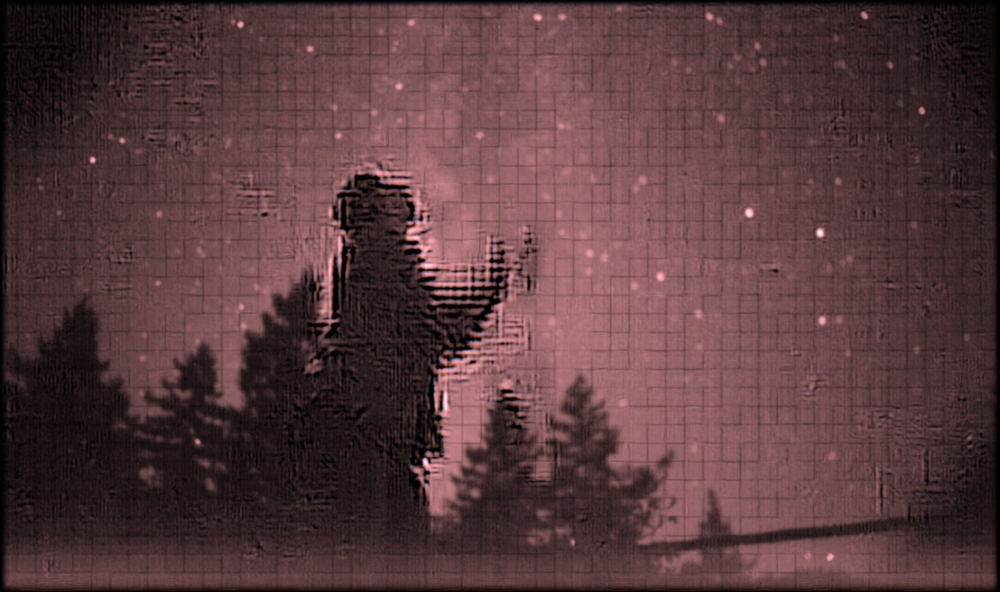
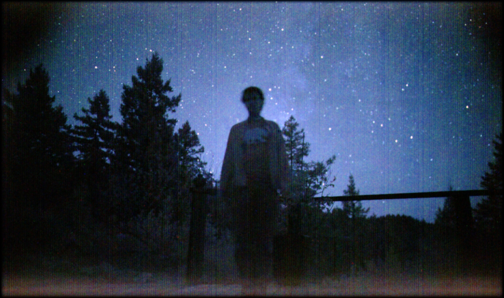

## 去模糊部分：

### 2022.10.22组会

#### 组会意见总结

+ 传统的3D方法

+ 增加图像的数量，可以选取H264用的16帧或19年论文中的13帧做

+ 使用深度学习方法（注意使用video的时序信息）

+ downsample：估计mv是可以，直接去模糊不需要

+ 在估计之前先做个图像预处理，简单的去噪方法即可

+ **关于overlap，alignment和dublur一起做** 

+ 了解2019ASIA 的运动算法

+ 了解视频去噪VBM4D的思想

#### 后续工作

+ 去模糊前需要简单的去噪预处理

+ 找传统的3D方法，尝试去模糊

+ 增加图像的数量，使用更多帧数估计运动，从而进行去模糊

+ 使用深度学习方法

+ 使用2019年ASIA的方法

+ Alignment和Deblur一起做

--------

### 2022.10.8-10.14 总结

+ 在先前的pipline的基础上，在merge前使用维纳滤波(+ TV) / fast deconvoltion，效果不明显

+ 看了相关噪声标定的方法：ELD，方差和均值拟合的方法

+ 修改了pipline图，整理代码框架(待上传)


+ 导入matlab里运动估计方法，得到MV：[code](https://github.com/qilinsun/UltralLowLightRawVideoISP/blob/main/Utility/matlab/motionEstDS.m)

### 2022.10.8-10.14 代码和对应测试结果

+ 使用H264方法和维纳滤波得到的最终结果,gamma=0.5(无overlap的)



+ 使用H264方法和维纳滤波的结合, gamma=0.15(overlap的)


------

### 2022.9.28——2022.10.7

**Step 1**: 目前的算法已经估计出了运动向量，根据向量计算长度和角度，

motionVector, (shape：[7, 63, 107, 2]) 根据此算出长度和角度，length和angle的shape均为[7, 63, 107]

代码如下：

```python
def motion_angle(motionvector):
  motionvector_y = motionvector[..., 0]
  motionvector_x = motionvector[..., 1]
  angle = np.arctan2(motionvector_y, motionvector_x)
  # angle = np.rad2deg(theta)
  
  return angle

def motion_vector_length(motionvector):
    n, h, w, _ = motionvector.shape
    length = np.zeros((n, h, w))
    angle = np.zeros((n, h, w))
    for i in range(len(motionvector)):
        if i == 0:
            mv = motionvector[i]
            mv_length = np.sqrt(mv[...,0]**2 + mv[...,1]**2)
            length[i, :, :] = mv_length
            mv_angle = motion_angle(mv)
            angle[i, :, :] = mv_angle
        else:
            cur_mv = motionvector[i]
            ref_mv = motionvector[i-1]
            diff_mv = cur_mv - ref_mv
            diff_mv_length = np.sqrt(diff_mv[...,0]**2 + diff_mv[...,1]**2)
            diff_mv_angle = motion_angle(diff_mv)
            length[i, :, :] = diff_mv_length
            angle[i, :, :] = diff_mv_angle

    return length, angle
```
**Step 2**: 根据计算出的每个角度和长度再生成模糊核

可计算出length和angle的组成63*107对

[code](https://github.com/qilinsun/UltralLowLightRawVideoISP/blob/main/Utility/PSF.py)

```python
import numpy as np


def get_motion_blur(length, angle, aligntiles):
    # 点扩散函数
    n, h, w, size1, size2 = aligntiles.shape
    PSF_sum = np.zeros((aligntiles.shape[0] - 1, aligntiles.shape[1],
                        aligntiles.shape[2], aligntiles.shape[3], aligntiles.shape[4]))
    PSF_aver = np.zeros((int(h * size1), int(w * size2)))
    PSF_vis = np.zeros((n-1, int(h * size1/2+size1/2), int(w * size2/2+size1/2)))
    for i in range(aligntiles.shape[0] - 1):

        x_center = (aligntiles[i].shape[2] - 1) / 2
        y_center = (aligntiles[i].shape[3] - 1) / 2

        motion_length = length[i]
        motion_angle = angle[i]

        sin_val = np.sin(motion_angle)
        cos_val = np.cos(motion_angle)

        # 计算每个tiles的psf 再reshape
        for j in range(motion_length.shape[0]):
            for n in range((motion_length.shape[1])):
                PSF = np.zeros((aligntiles.shape[3], aligntiles.shape[4]))
                if motion_length == 0:
                    # 该块处的PSF置为0
                    PSF_sum[i, j, n, ...] = PSF
                else:
                    for m in range(int(np.round(motion_length[j][n]))):
                        x_offset = np.round(sin_val[j, n] * m)
                        y_offset = np.round(cos_val[j, n] * m)
                        x_1 = x_center - x_offset
                        y_1 = y_center + y_offset
                        if 0 <= x_1 < (aligntiles.shape[3]) and 0 <= y_1 < (aligntiles.shape[4]):
                            x = x_1
                            y = y_1
                        else:
                            x = x_center
                            y = y_center

                        PSF[int(x), int(y)] = 1

                    # 这部分有些算出得0是因为没有位移，length为0，所以加了判断
                    PSF = PSF / PSF.sum()
                    PSF_sum[i, j, n, ...] = PSF

                    PSF_aver[(int(size1/2) * j):(int(size1/2) * j + size1),\
                    (int(size2/2)* n):(int(size2/2) * n + size2)] = PSF
        
        PSF_vis[i, ...] = PSF_aver
    # 可视化   
    for v in range(PSF_vis.shape[0]):
        psf_path = "/home/cuhksz-aci-03/Documents/UltralLowLightRawVideoISP-main/psf_result/" + str(v) + '.png'
        cv2.imwrite(psf_path, PSF_vis[v])

    return PSF_sum
```
+ 根据MV计算出的PSF结果(该结果乘了255之后的显示结果)

 

+ HDR+ MV 


**Step 3**: 普通维纳滤波

代码如下：

```python
 # 维纳滤波，K=0.01
def wiener(input, PSF, eps, K=0.01):       
    input_fft = fft.fft2(input)
    PSF_fft = fft.fft2(PSF) + eps
    PSF_fft_1 = np.conj(PSF_fft) / (np.abs(PSF_fft) ** 2 + K)
    result = np.fft.ifft2(input_fft * PSF_fft_1)
    result = np.abs(np.fft.fftshift(result))
    return result
```
**普通的维纳滤波得不出结果**，改为deep optics中的方法，[code(tf-->pytorch)](https://github.com/qilinsun/UltralLowLightRawVideoISP/blob/main/Utility/wiener.py)

不同gamma值的结果(随便选的), 以下这些图片和相应的视频[Click](https://github.com/qilinsun/UltralLowLightRawVideoISP/tree/main/Docs/starlight)

+ code: 在原代码的HDR+ pipelin中增加了deblur部分

```python
# Hdrplus pipeline
        motionVectors, alignedTiles = alignHdrplus(referenceImg,alternateImgs,self.mbSize)
        
        # Deblur
        motion_length, motion_angle = motion_vector_length(motionVectors)
        PSF = get_motion_blur(motion_length, motion_angle, alignedTiles)

        deb_img = np.zeros(alignedTiles.shape)
        deb_img[-1, ...] = alignedTiles[-1, ...]
        for j in range(PSF.shape[0]):
            for m in range(PSF.shape[1]):
                for n in range(PSF.shape[2]):
                    blurred = repeat(alignedTiles[j, m, n, ...], 'h w -> b h w c', b=1, c=1) 
                    PSF_trans = repeat(PSF[j, m, n, ...], 'h w -> h w c d', c=1, d=1)
                    # transfer tensor
                    blurred = torch.tensor(blurred)
                    PSF_trans = torch.tensor(PSF_trans)
                    deblur_img = inverse_filter(blurred, blurred, PSF_trans, init_gamma=1.5)
                    deblur_img = deblur_img.squeeze()
                    deblur_img = deblur_img.detach().numpy()

                    deb_img[j, m, n, ...] = deblur_img

        alignedTiles = deb_img
        
        mergedImage = mergeHdrplus(referenceImg, alignedTiles, self.padding, 
                                   self.lambdaS, self.lambdaR, self.params, self.options)
        mergedImage = np.clip(mergedImage,0,self.whiteLevel)
        
        # ISP process
        ISP_output = starlightFastISP(mergedImage)
```

+ deblur之前的结果_17Seq0



+ gamma=0.5_17Seq0


+ gamma=1.5_17Seq0


+ gamma=5_17Seq0


### 目前的问题

+ HDR+ 的方法做运动估计可能不行，需要换运动估计方法, 换了ARPS方法(这部分代码之前的同学已经转换完，自己对照C++检查学习)，[code(C++-->Python)](https://github.com/qilinsun/UltralLowLightRawVideoISP/blob/main/Utility/utils.py)

### Todo

+ 将ARPS放入到Pipeline中，得到MV，再看motion deblur的效果
