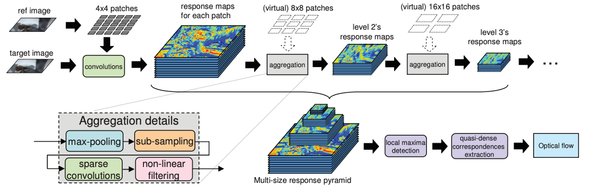
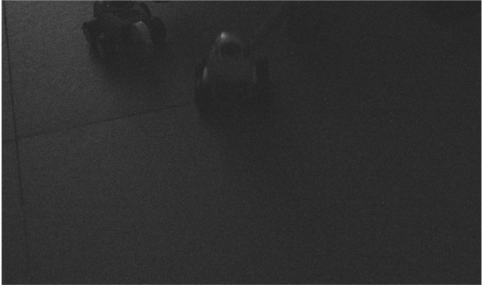
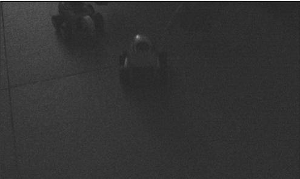
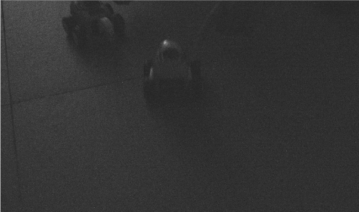

## 极暗光Raw视频去噪

### Final Goal

在极暗光环境下(lux: 0.1, 0.01和0.001)实现实时的对raw视频的去噪

### Idea

夜景视频拍摄：深度学习，基于多帧融合

深度学习：可解释性差，泛化性能差

基于多帧融合的方法

FIFO

运动模糊

高噪声

------

### To do list 2023.5.29

- [x] 噪声估计
  + Imatest
  + 公式：𝒙_𝒑~ 𝝈_𝒔^𝟐 𝓟(𝒚_𝒑/𝝈_𝒔^𝟐) + 𝓟(𝑵_𝑭𝑷𝑵) + 𝓝(𝟎,𝝈_𝒓^𝟐)

+ 图像数据拍摄

  - [x] 0.1 静态和动态Raw视频序列

  - [x] 0.01 静态和动态Raw视频序列

  - [ ] 0.001 静态和动态Raw视频序列

- [x] FIFO结构 

+ 单帧图像处理
  - [x] 帧内图像去模糊
  - [x] 使用BM3D硬阈值方法先对sensor的噪声进行去噪

- [ ] 帧间匹配
- [x] 将匹配完的图像进行堆叠，使用BM4D方法在进行去噪
- [ ] ISP调优

------

- [x] 运动模糊，利用帧间关系，ESTRNN方法 (训练数据是通过rgb转换成raw图做的)
  + 制作训练数据，[code](https://github.com/swz30/CycleISP)
  + ESTRNN，[code](https://github.com/zzh-tech/ESTRNN)

------

### Pipeline 2023.5.29

### 根据Pipeline每一步的实验结果

#### BM4D

+ 说明

+ 代码

  + [bm4d](https://github.com/qilinsun/UltralLowLightRawVideoISP/blob/main/bm4d_pipeline/examples/run_bm4d_v3.py)

+ 参数的设置

  + 输入：16张原始Raw图像堆叠的三维图，size (h, w, 16)，第一帧为当前帧
  + 将输入的数据+3/8开根号
  + 噪声估计：利用的iccv的噪声估计算法，估计堆叠的所有图像的噪声方差
  + 硬阈值变换：bior1.5，块：4 * 4 * 4，搜索步长：3 * 3 * 3，搜索窗口： 7 * 7 * 7，块的相似性阈值：200000，数量：16
  + 维纳协同滤波: dct，块：4 * 4 * 4，搜索步长：3 * 3 * 3，搜索窗口： 7 * 7 * 7，块的相似性阈值：50000，数量：32
  + 输出：输出结果，图像先平方-3/8后输出

  Ps: 以上这些均分通道过一遍

+ 实验结果

**0.1 静态**

|                        Orignial image                        |                             BM4D                             |                             HDR+                             |                          Maskdngan                           |                            Hrnet                             |
| :----------------------------------------------------------: | :----------------------------------------------------------: | :----------------------------------------------------------: | :----------------------------------------------------------: | :----------------------------------------------------------: |
|  |  |  |  |  |

**0.1 动态**

|                        Orignial image                        |                             BM4D                             |                             HDR+                             |                          Maskdngan                           |                            Hrnet                             |
| :----------------------------------------------------------: | :----------------------------------------------------------: | :----------------------------------------------------------: | :----------------------------------------------------------: | :----------------------------------------------------------: |
|  |  |  |  |  |

**0. 01 静态**

|                        Orignial image                        |                             BM4D                             |                             HDR+                             |                          Maskdngan                           |                            Hrnet                             |
| :----------------------------------------------------------: | :----------------------------------------------------------: | :----------------------------------------------------------: | :----------------------------------------------------------: | :----------------------------------------------------------: |
|  |  |  |  |  |

**0. 01 动态**

|                        Orignial image                        |                             BM4D                             |                             HDR+                             |                          Maskdngan                           |                            Hrnet                             |
| :----------------------------------------------------------: | :----------------------------------------------------------: | :----------------------------------------------------------: | :----------------------------------------------------------: | :----------------------------------------------------------: |
|  |  |  |  |  |

------

#### Pre-processing

+ 说明

  + 将镜头盖住，连续拍摄多帧图像，然后对这一系列图像平均，估计传感器噪声

  + 然后将估计的传感器噪声和极暗光下拍的图像输入到bm3d硬阈值方法中

  + 在增加了块剔除方法后，在原本的bm3d硬阈值方法中找到一定数量的块后，把不符合要求的块去掉，其余块做硬阈值滤波去噪

  + 块去除方法

    + 先将图像进行傅立叶变换，并将低频分量移到频域图像的中心位置

    + 获取高频信息：(1) 生成了圆形滤波器，圆内值为0，其余部分为1 (半径为4)

      ​						   (2) 利用圆形滤波器将第一步中频域图的低频信息过滤掉

    + 得到高频分量后并做了一个平均

    + 然后将其排序 (由高到低)，获取其索引值

    + 然后根据索引值，取前几位的图像和对应位置坐标

+ 代码

  + 噪声估计，[code1](https://github.com/qilinsun/UltralLowLightRawVideoISP/blob/main/bm4d_pipeline/examples/est_noise.py), [code2](https://github.com/qilinsun/UltralLowLightRawVideoISP/blob/main/bm4d_pipeline/examples/run_predenoise.py)
  + BM3D硬阈值方法去除sensor噪声, [code](https://github.com/qilinsun/UltralLowLightRawVideoISP/blob/main/bm4d_pipeline/examples/run_predenoise.py)
  + 统计图像块的低频和高频信息(使用低通滤波和高通滤波实现)，将低频信息少的图像块扔掉，其余部分进行滤波去噪, [code](https://github.com/qilinsun/UltralLowLightRawVideoISP/blob/main/bm4d_pipeline/examples/bm3d_1st_step.py)

+ 参数的设置

  + 单独BM3D硬阈值预处理方法
    + 块: 8 * 8, 搜索步长: 3 * 3, 块数: 16, 搜索区域: 19 * 19, 相似块阈值: 50000, 硬阈值去噪的阈值: 自动调整

  + BM3D硬阈值结合剔除块处理方法 (设定20块，扣除4块高频分量少的)
    + 块: 8 * 8, 搜索步长: 3 * 3, 块数: 16, 搜索区域: 19 * 19, 相似块阈值: 500000, 硬阈值去噪的阈值: 2.7

+ 实验结果

  + bm3d预处理结果

  **0.1 静态**

  |                        Orignial image                        |                      Predenoising image                      |
  | :----------------------------------------------------------: | :----------------------------------------------------------: |
  |  |  |

  **0.1 动态**

  |                        Orignial image                        |                      Predenoising image                      |
  | :----------------------------------------------------------: | :----------------------------------------------------------: |
  |  |  |

  **0.01 静态**

  |                        Orignial image                        |                      Predenoising image                      |
  | :----------------------------------------------------------: | :----------------------------------------------------------: |
  |  |  |

  **0.01 动态**

  |                        Orignial image                        |                      Predenoising image                      |
  | :----------------------------------------------------------: | :----------------------------------------------------------: |
  |  |  |

  + 使用灰度图像测试提取高频低频部分

  |                        Original image                        |                     High frequency image                     |                     Low frequency image                      |
  | :----------------------------------------------------------: | :----------------------------------------------------------: | :----------------------------------------------------------: |
  |  |  |  |

  + 使用模糊的灰度图像进行块剔除测试

  |                         Sharp image                          |                          Blur image                          |                         Noisy image                          |                          BM3D_image                          |                        NewBM3D_image                         |
  | :----------------------------------------------------------: | :----------------------------------------------------------: | :----------------------------------------------------------: | :----------------------------------------------------------: | :----------------------------------------------------------: |
  |  |  |  |  |  |

  + 拍摄图像的对比结果	

  **0.1 动态**

  |                        Original image                        |                          BM3D Image                          |                       BM3D_Block Image                       |
  | :----------------------------------------------------------: | :----------------------------------------------------------: | :----------------------------------------------------------: |
  |  |  |  |

  **0.01 动态**

  |                        Original image                        |                          BM3D Image                          |                       BM3D_Block Image                       |
  | :----------------------------------------------------------: | :----------------------------------------------------------: | :----------------------------------------------------------: |
  |  |  |  |

------

#### ESTRNN 

+ 方法

+ 数据集

|                            RGB_GT                            |                            Raw_GT                            |                           RGB_Blur                           |                           Raw_Blur                           |
| :----------------------------------------------------------: | :----------------------------------------------------------: | :----------------------------------------------------------: | :----------------------------------------------------------: |
|  |  |  |  |

+ 实验结果

|                              GT                              |                            Input                             |                            Output                            |
| :----------------------------------------------------------: | :----------------------------------------------------------: | :----------------------------------------------------------: |
|  |  |  |

------

#### Patch match

+ 说明

  + Deepflow部分. 
    + 先将Raw图像进行下采样(将四个通道RGGB进行平均)，得到一组下采样图像
    + 利用deepflow算法(调用的opencv里的deepflow函数)，计算相邻帧(前一帧与后一帧之间的光流图)
    + 然后后一帧根据光流图进行warp得到对齐图像
  + 计算中间帧位移并进行图像对齐
    + 利用deepflow方法，计算出相邻帧的光流
    + 根据计算出的帧间光流计算出位移向量
    + 计算中间帧相对于第一帧的位移向量 
    + 计算每一帧相对于中间帧的位移向量
    + 对齐图像

+ 代码
  + [Deepflow](https://github.com/qilinsun/UltralLowLightRawVideoISP/blob/main/bm4d_pipeline/examples/test_raw.py)
+ 参数的设置
  + 原库函数
+ 实验结果

   **降采样的第四帧和第五帧**

|                        Downsample # 3                        |                        Downsample # 4                        |
| :----------------------------------------------------------: | :----------------------------------------------------------: |
|  |  |

   **第四帧和第五帧之间的光流图**

   

   **第五帧向第四帧对齐的图片**

   
------
