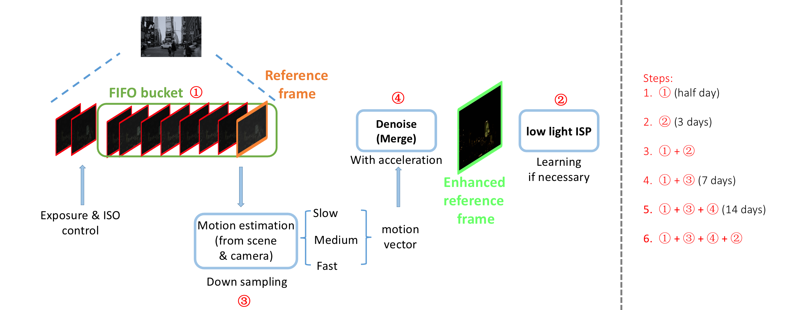
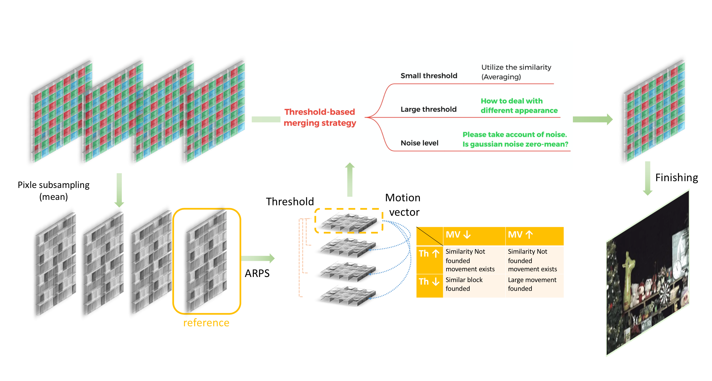

# LowLightR2V

## Project pipeline

Merging

### Todo
 - [x] FIFO bucket
 - [x] Alignment
 - [x] Merging 
 - [x] ISP comparison ([pytorch accelarate HDR+ rawpy](https://github.com/martin-marek/hdr-plus-pytorch) v.s. [HDR+ halide ISP](https://github.com/792x/HDR-Plus-Python) v.s. fastOpenISP)
 - [x] RGB-NIR interpolation
 - [ ] ISP optimization
 - [ ] FFCC AWB
 - [ ] Add methods for comparison ([HDR+ implementation in C](https://github.com/timothybrooks/hdr-plus) & [weight FBA](https://github.com/remicongee/Fourier-Burst-Accumulation)) 

### Sensei Todo
 - [ ] Code framework
 - [ ] Writing framework